# How to get AWS IoT parameters for ThingsPro AWS IoT connection UI

## To fill up the parameters below, do the following steps:
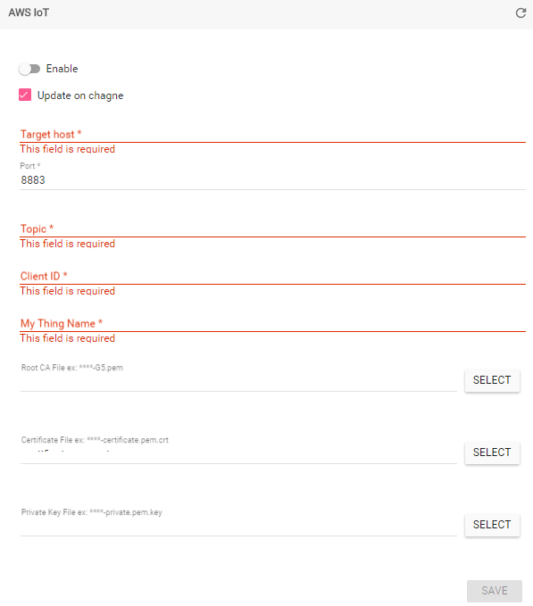

1.  Login AWS services, click AWS IoT
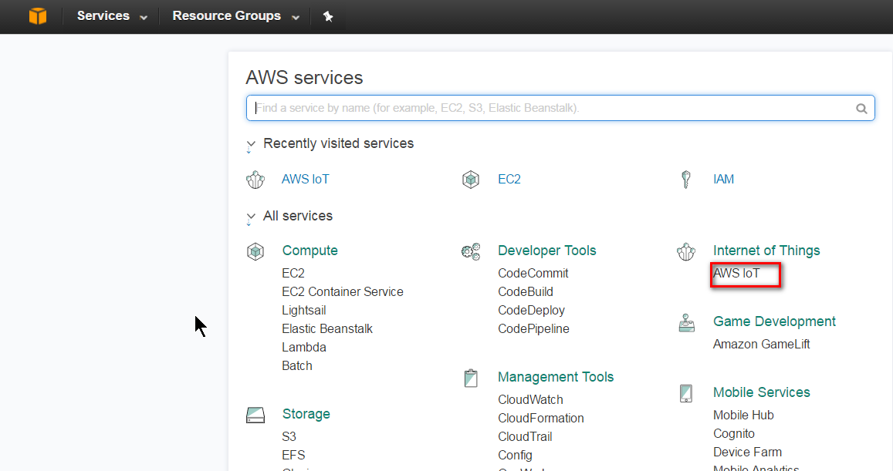
You will see the dashboard.
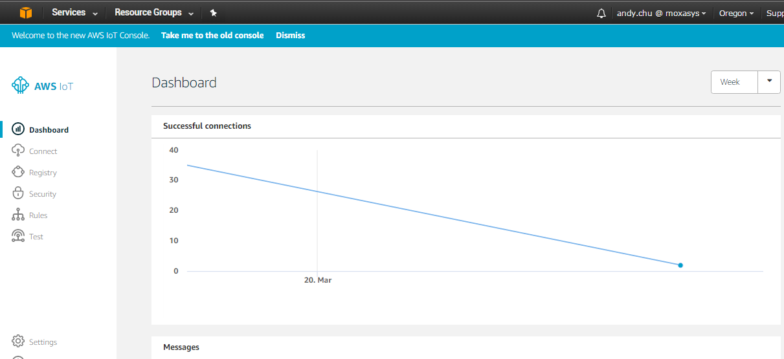

2.  Click **connect** and Click **Get started**.
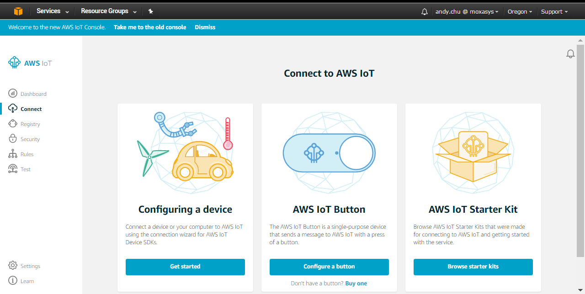

3.  Click Linux/OSX and Click Python
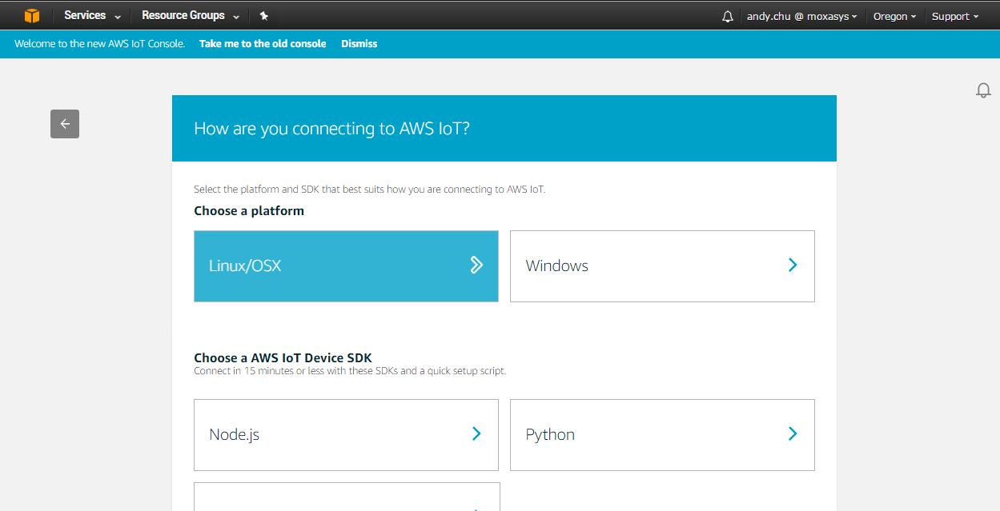

4.  Click Get started
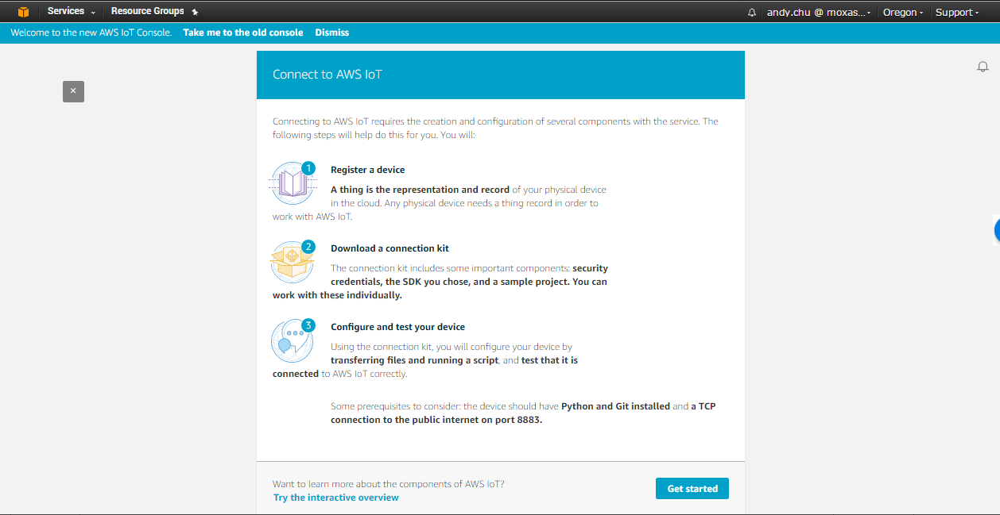

5.  Fill in the thing name. e.g.:8112. This name will be used for
    **Client ID** and **My Thing name** of ThingsPro AWS IoT connection
    UI.
    Click next step when finishing fill the name.
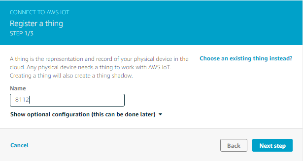

6.  Click Download connect kit. After finish download, click next step.
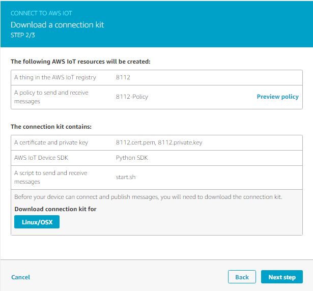

7.  Click Done.
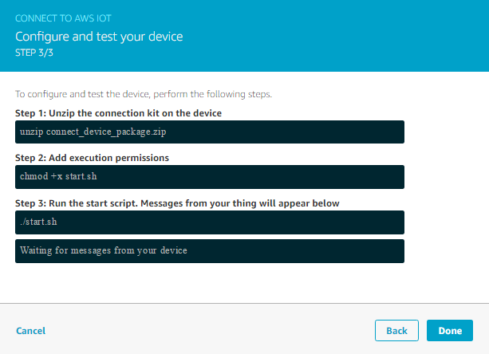

8.  Unzip the downloaded connect\_device\_package.zip, you will get
    private key, certificate file …etc.
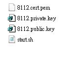

9.  Download AWS root-CA file from following URL:
    [*https://www.symantec.com/content/en/us/enterprise/verisign/roots/VeriSign-Class%203-Public-Primary-Certification-Authority-G5.pem*](https://www.symantec.com/content/en/us/enterprise/verisign/roots/VeriSign-Class%203-Public-Primary-Certification-Authority-G5.pem)

10.  Copy the content, save it as **root-CA.crt** together with private
    key, certificate file. **root-CA.crt** , **private key** and
    **certificate file** will be used for ThingsPro AWS IoT connection
    UI
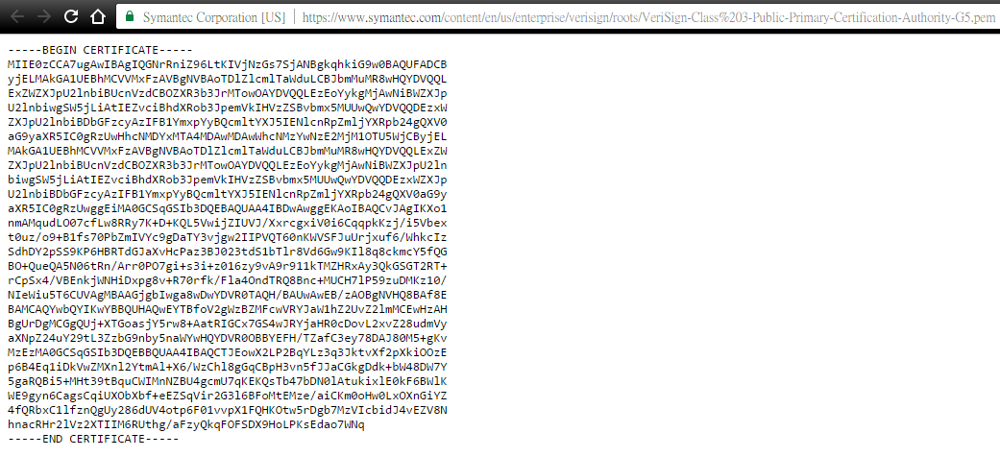

11.  Back to your Dashborad click Registry and Things. You should see the
    “thing” you just created. Click it.
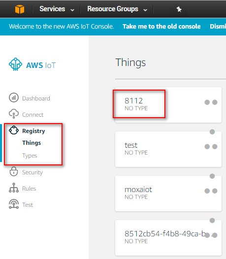

12.  Click interact
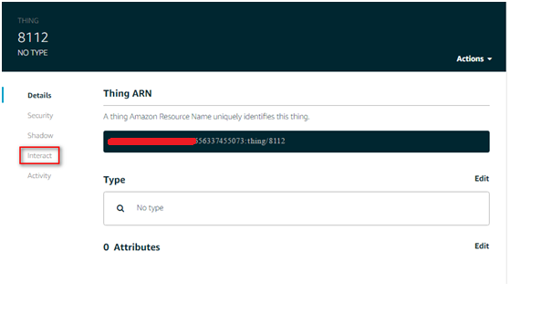

14.  The Endpoint is the target host of ThingsPro AWS IoT connection UI.
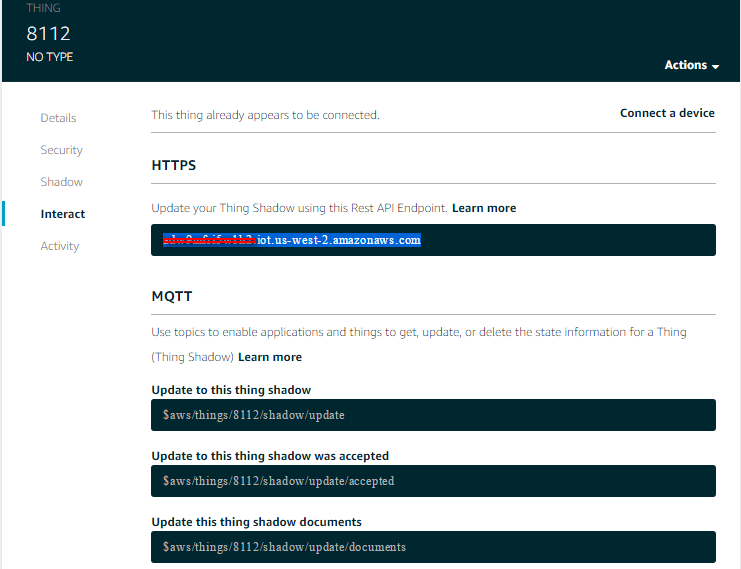

15.  The topic is as below:
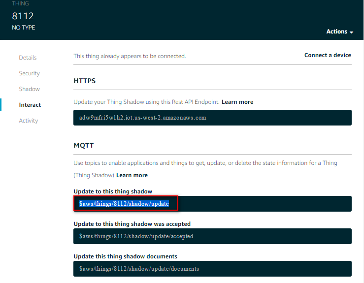

Finally, you should be able to fill up all required information for
connecting to AWS IoT service.

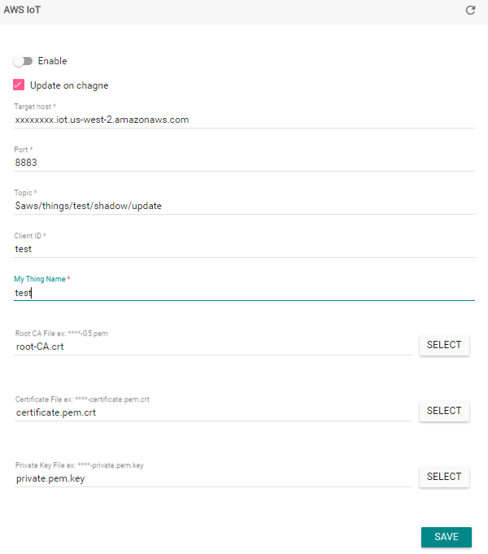
