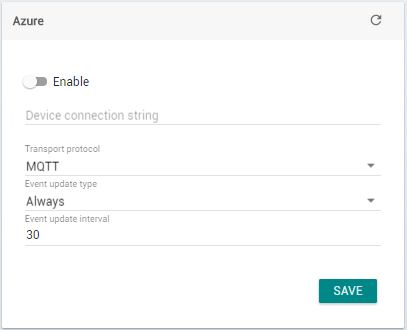
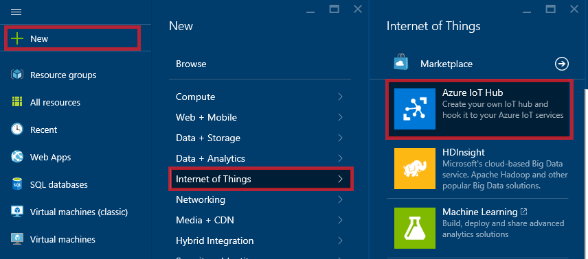
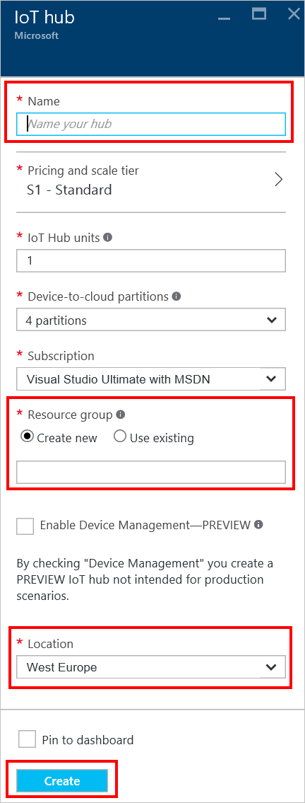
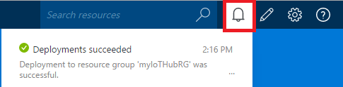
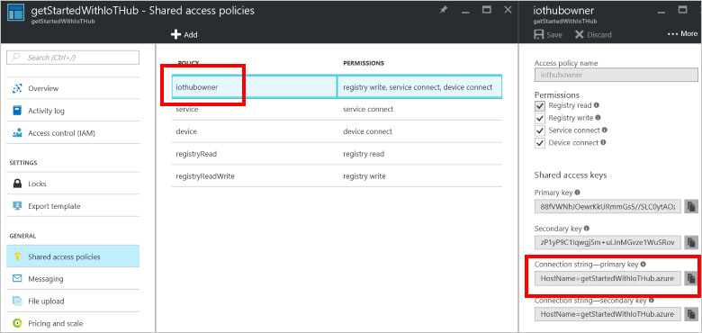
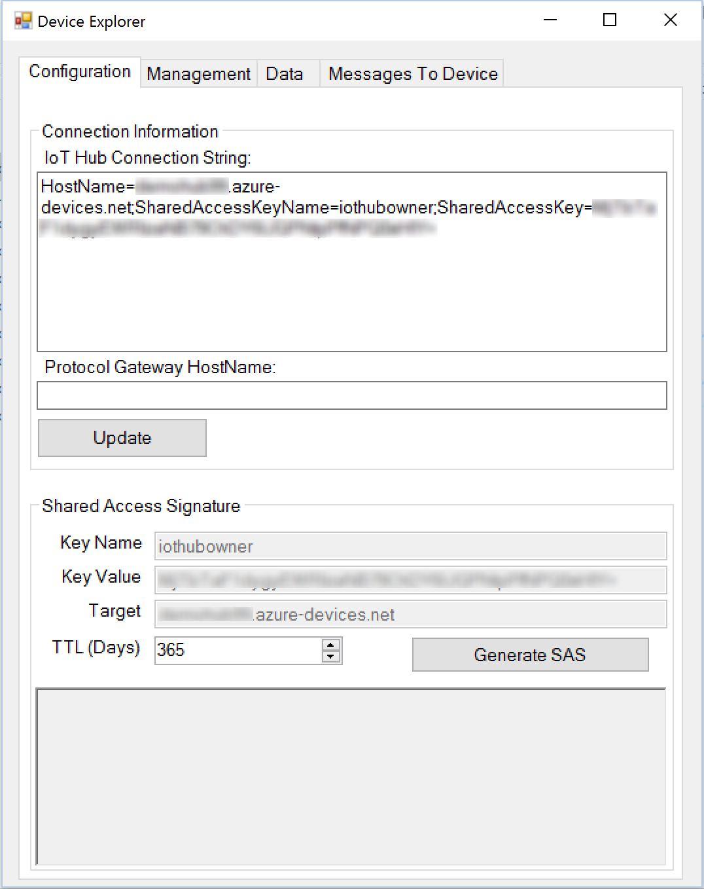
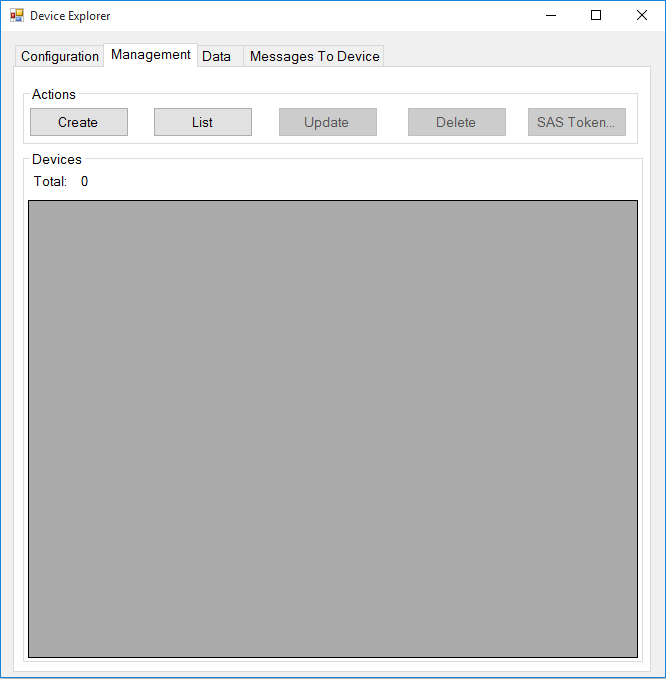
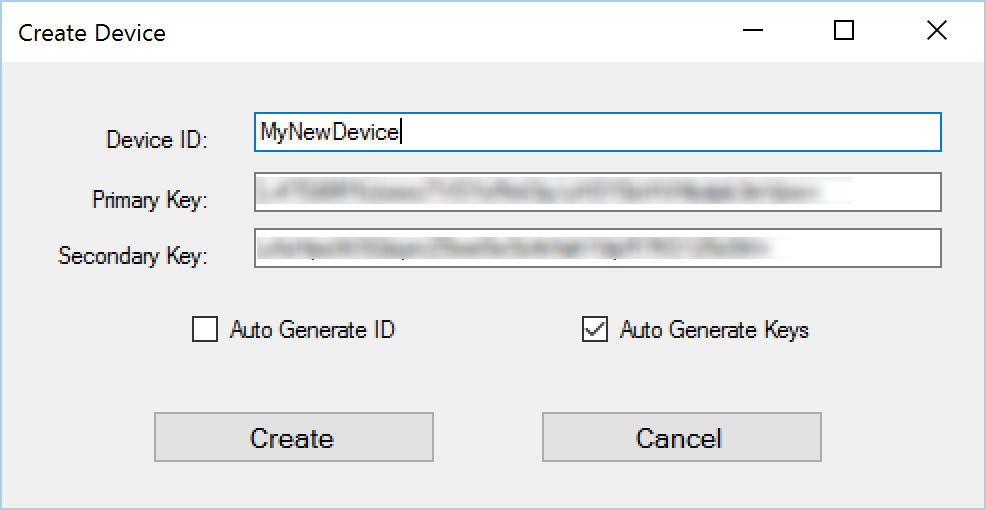
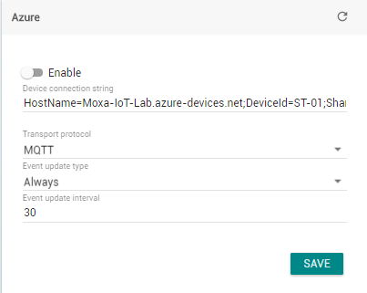

# How to get Azure IoT Device connection string for ThingsPro Azure IoT connection UI

## To fill up the parameters below, do the following steps:

1.  Log on to the [Azure Portal](https://portal.azure.com/).

2.  In the jumpbar, click **New**, then click **Internet of Things**,
    and then click **Azure IoT Hub**.

3.  In the **New IoT Hub** blade, specify the desired configuration for
    the IoT Hub.

 > * In the **Name** box, enter a name to identify your IoT hub. When the **Name** is validated, a green check mark appears in the **Name** box.
 > * Change the **Pricing and scale tier** as desired. The getting started samples do not require a specific tier.
 > * In the **Resource group** box, create a new resource group, or
     select and existing one. For more information, see [Using resource
     groups to manage your Azure
     resources](https://azure.microsoft.com/documentation/articles/resource-group-portal/).
 > * Use **Location** to specify the geographic location in which to host your IoT hub.

4. Once the new IoT hub options are configured, click **Create**. It
    can take a few minutes for the IoT hub to be created. To check the
    status, you can monitor the progress on the Startboard. Or, you can
    monitor your progress from the Notifications section.

5.  After the IoT hub has been created successfully, open the blade of
    the new IoT hub, take note of the hostname URI, and click **Shared
    access policies**.

6.  Select the Shared access policy called **iothubowner**, then copy and take note of the **connection
    string** on the right blade.

Your IoT hub is now created, and you have the connection string you need
to use the [Device
Explorer](https://github.com/Azure/azure-iot-sdk-csharp/blob/master/doc/manage_iot_hub.md) tool.
This connection string enables applications to perform management
operations on the IoT hub such as adding a new device to the IoT hub.

Add devices to IoT Hub
----------------------

You must add details your device to IoT Hub before that device can
communicate with the hub. When you add a device to an IoT hub, the hub
generates the connection string that the device must use when it
establishes the secure connection to the IoT hub.

To add a device to your IoT hub, you can use [the Device
Explorer](https://github.com/Azure/azure-iot-sdk-csharp/blob/master/doc/manage_iot_hub.md) utility
in this repository
([azure-iot-sdks](https://github.com/Azure/azure-iot-sdks)). It will
generate a device specific connection string that you need to copy and
paste to ThingsPro Azure IoT connection UI.

## Do the followings to get **Device connection string.**

1.  Install and run Device Explorer utility.

2.  On the **Configuration** tab, paste the [*IoT Hub
    connection-string*](#iothubconnectionstring) for your IoT hub
    into **IoT Hub connection string** and click **Update**:

3.  Register a new device with IoT Hub: Click the **Management** tab to
    manage the devices connected to the IoT hub.
    click **Create** to register a new device with your IoT hub.

4.  The **Create Device** dialog appears. In the **Device ID** field,
    type a unique name for your device such as **mydevice**, or
    select **Auto Generate ID** to generate a unique ID. Then
    click **Create**.

5.  Right-click on a selected device to retrieve the connection string
    for your device:

6.  Select **Copy connection string for selected device** to copy the
    device connection string to the clipboard. The samples in this
    repository use connection strings in the
    format HostName=&lt;iothub-name&gt;.azure-devices.net;DeviceId=&lt;device-name&gt;;SharedAccessKey=&lt;device-key&gt;.

> For further information about using the Device Explorer tool to
> perform tasks such as disabling a device, monitoring a device, and
> sending commands to a device see [*Using the Device Explorer
> tool*](https://github.com/Azure/azure-iot-sdk-csharp/blob/master/tools/DeviceExplorer/readme.md).

Finally, fill up the Device connection string and select preferred
parameters for connecting to Azure IoT service.

