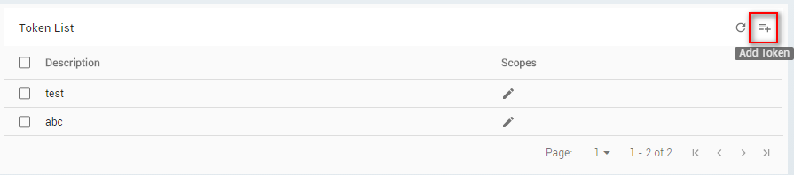
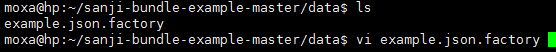

# How to Use ThingsPro Gateway's RESTful API in Your Programs

## Introduction
All ThingsPro Gateways (for example, UC-8112-LX) provide a RESTful application programming interface (API) for developers who want to interact with ThingsPro and integrate their software with it. Excluding web account operations, you can use this RESTful API for all other gateway operations such as bootstrap, Ethernet, and iptables.
This document gives you an overview of how to use ThingsPro Gateway’s RESTful API in your programs to determine information such as the gateway resources available, the HTTPS methods supported, and the content of the requests and responses. Refer to the ThingsPro RESTful API Reference for additional details.

## Prerequisites

+ A Moxa UC-8112 computer with ThingsPro Gateway installed and Internet access enabled
+ PC/notebook with Chrome browser and the necessary programming languages installed
+ Chrome browser with the Postman app installed
+ ThingsPro Handbook

## Solution
To use ThingsPro Gateway RESTful API in your programs, do the following:

### Step 1. Connect the Gateway to a PC/Notebook

Use an Ethernet cable to connect a LAN port on the PC/Notebook to the LAN 2 port on the UC-8112 computer.


### Step 2. Generate an API Token in ThingsPro
To be able to use the ThingsPro RESTful API in your programs, you must provide an API token for authentication by setting the mx-api-token parameter in the API header to an API token generated by ThingsPro. 
To generate an API token in ThingsPro, do the following: 
+ Open the Chrome browser and access the ThingsPro web interface by connecting to the URL:https://192.168.4.127
+ Click **GET STARTED** to open the login page.


+ Use the following root user credentials to login
  
    **Email**: root@moxa.com  
    **Password**: root1234


+ Click on the Menu icon 


+ Click **Token**


+ Click on the Add token icon


 
+ Fill in a token description, select the scope (e.g., Read, Read/Write), and click **SAVE**.


 

***NOTE: The scope of the token includes Read and Read/Write privileges. Select Read as the scope, if you only need to get Gateway related information through the RESTful API. Select Read/Write as the scope, if you need to configure the Gateway parameters through the API.***

The API token will be displayed at the top of the webpage. 


+ Click on the copy icon next to the token string to copy it and save the token string in a text file for future use during the development process.

***Note: After you click on the copy icon the token string will disappear from the webpage. Hence, save the token string immediately into a text file soon after you copy it. If you do not do so, you will have to generate a new token because the system does not store the token that you generate.***

### Step 3. Access the ThingsPro Gateway APIs 

The URI for the ThingsPro API is given below:
```
https://localhost/api/v1/<resource>
```

The final part of the URI is the name of the resource, which determines the response that you will receive from the API. Some resources may require additional path parameters to identify a specific resource. For example, the URI for the system status would look like this:

```
https://localhost/api/v1/system/status
```
A Chrome extension called Postman can help you emulate the request and response behavior between your program and the ThingsPro Gateway RESTful API.

The following examples will show you how to read (get) and write (put) ThingsPro Gateway RESTful API parameters from a notebook/PC.  

#### Example 1: Reading the system status of the UC-8112 computer
a. Use a file explorer to open the ThingsPro Handbook in the ThingsPro Gateway RESTful API documentation available at: \thingspro-handbook\output\reference\gateway-ui\


b. Double-click the index.html file to open the page with the list of ThingsPro Gateway RESTful APIs.  
c. Click on the status API to view a list of the resources.


 
d. Select the /system/status resource to view the description and the response code  
e. Click on the example value to view the example value of system status


f. Use the Postman app to read the value from the /system/status resource

* Open the Chrome Browser and run the Postman app
* Select the GET option

    

* Enter https://<IP address of UC8100>/api/v1/<resource> in the **Enter request URL** field

    
    
    E.g.: https://192.168.4.127/api/v1/system/status 
* Select the **Headers** tab, Click on the key column and enter the keyword mx-api-token
* Click the Value column and paste token value that you have saved earlier

    
    
* Click **Send** to send the request to the ThingsPro Gateway RESTful resource. You will recieve the following:

    

#### Example 2: Updating the hostname for the UC-8112 computer
	
a.	Set new settings of the specific resource
b.	Select PUT/POST, based on ThingsPro Gateway RESTful API reference
    
c.	Fill in “Enter request URL” field with https://<IP address of UC8100>/api/v1/<resource uri>
Ex: https://192.168.4.127/api/v1/system/status
    
d.	Click Body, Select raw, Select JSON and fill in your settings by JSON format.
e.	Click Send to send the request to the bundle then it will response the same format you sent.

When everything is as expected, you can use the programming language you preferred to develop program to access ThingsPro Gateway resource.
Refer to handbook. It demonstrates how to curl command, C and Python language access these resource.
    
### Step 4. Create program bundles
ThingsPro has already provide essential RESTful APIs for device management and data acquisition framework. By creating a custom bundle, developers could extend the existed RESTful APIs with your own endpoints. Also, you are able to get/set parameters of your program through your RESTful API. If you don’t need to create your own RESTful APIs, skip this step.

* Download  sample bunsdle 
* Upload the sample to 192.168.4.127 
* Login UC-8112 and decompress it.
    

* Change directory to the sample
     
* Edit bundle.json to define the parameters of your own RESTful APIs.
    
    
``` 
{
  "name": "example",
  "version": "0.0.1",
  "author": "Your Name Here",
  "email": "example@com.com",
  "description": "Description of this bundle",
  "license": "GPL",
  "main": "index.py",
  "argument": "",
  "priority": 99,
  "hook": [],
  "dependencies": {},
  "repository": "",
  "role": "model",
  "ttl": 60,
  "resources": [
    {
      "methods": ["get", "put"],
      "resource": "/example"
    }
  ]
}
```

| **Parameters** | **Description** |
| ----------- | --------------------------------------------------------------------|------------------------------|
|name	|	Name of this bundle, format: [A-Za-z-]+	|  |
|version | Version number |    |
|author	| Author name |    |
|email	| Author's email |    |
|description | Description of this bundle |  |
|license | MIT, GPL, BSD, etc. |	 |
|main | fixed value: index.py | index.py is the entry point of the processing RESTful requests. After defining bundle.json, you have to edit index.py to implement methods to  process requests. |
|argument | Reserved | |
|priority | Reserved |	|
|hook | Reserved	|  |
|dependencies | Reserved |	 |
|repository | Reserved	|   |
|role | fixed value: model |   |
|ttl | Time to live (unit: second), this bundle should always response within n seconds. | Default value is 60 sec. |
|resources | method
o	    Single method: get, put, post, delete
o	    Array of methods: ["get", "post"]
‧	Resource
o	    Endpoint of this bundle (ex:/example) | ThingsPro supports post, get, put, delete HTTP methods. These correspond to create, read, update, and delete (or CRUD) operations respectively. Above mentioned, you have to edit index.py to implement methods to  process RESTful requests. |


* Change directory to data
    

* Edit the example.json.facotry (JSON format) to define the parameters of RESTful API.  
    
The default definition is as below:
    

*** Note: the filename must be the same as the name parameter in bundle.json ***
    

* Edit index.py. There are two methods in index.py. Based on your needs to develop your code to handle requests.
    
    
 
After finishing your code, remember to save it.
* Execute bundle, after developing your program.
    

```
2017-03-13 18:54:14,452 - DEBUG - 33 - Model: example config has been loaded.
2017-03-13 18:54:14,461 - DEBUG - 96 - Custom init start
2017-03-13 18:54:14,468 - DEBUG - 98 - Custom init finish
2017-03-13 18:54:14,475 - DEBUG - 228 - Thread pool is created
2017-03-13 18:54:14,479 - DEBUG - 63 - Start connecting to broker
2017-03-13 18:54:14,502 - DEBUG - 335 - Connection established with result code 0
2017-03-13 18:54:17,376 - DEBUG - 89 - Unsubscribe: ('c60b3b12913c426e9342c635becc5239',)
2017-03-13 18:54:17,383 - DEBUG - 98 - Subscribe: ('c60b3b12913c426e9342c635becc5239',)
2017-03-13 18:54:17,523 - DEBUG - 422 - Deregister successfully example tunnel: None
2017-03-13 18:54:17,594 - DEBUG - 422 - Deregister successfully example-view tunnel: None
2017-03-13 18:54:17,651 - DEBUG - 98 - Subscribe: ('128916389',)
2017-03-13 18:54:17,654 - DEBUG - 410 - Register successfully example tunnel: 128916389
2017-03-13 18:54:17,656 - DEBUG - 377 - example-view no need to register due to no resources
```

* Test RESTful API with POSTMAN (refer to Step3 mentioned above)
* Launch Postman from chrome, GET https://192.168.4.127/api/v1/example
* Click Send button, you will get the response keys and values defined in example.json.facotry
    

When everything is as expected, you can use the programming language you preferred to develop program to access the resources

