# How to use RESTful API of ThingsPro Cloud Sever

## Introduction

> This document gives you an overview of how to use ThingsPro RESTful
> API in your program, such as the resources available, the HTTPS
> methods supported, and the content of the requests and responses,
> please refer to the ThingsPro RESTful API Reference.This document
> describes the usage of the ThingsPro *RESTful API*.

## Prerequisites

> In this guide, the following hardware and software are used:

-   A Moxa UC-8112 with ThingsPro Gateway and Internet access.

-   PC/Notebook with Chrome browser, programming language installed and Internet access.

-   Chrome browser with postman installed

-   ThingsPro Cloud Server installed

-   thingspro-handbook

## Using RESTful API of ThingsPro Cloud Sever to control ThingsPro Cloud gateway, do the following steps

### Step 1. Setup Development environment

-   Make sure PC/Notebook, ThingsPro Gateway and ThingsPro Cloud Server is able to access internet and communicate with each other.

### Step 2. Get API Token

To use ThingsPro RESTful API in your program, you have to
set **mx-api-token**: &lt;token&gt; in headers for authorization. To get
API token, do the followings:

-   Open Chrome browser and access the **ThingsPro Cloud Server** web
    interface by connecting to the URL: http://&lt;**Your Thingspro
    server IP**&gt;

-   Click Get Started to open the login page.

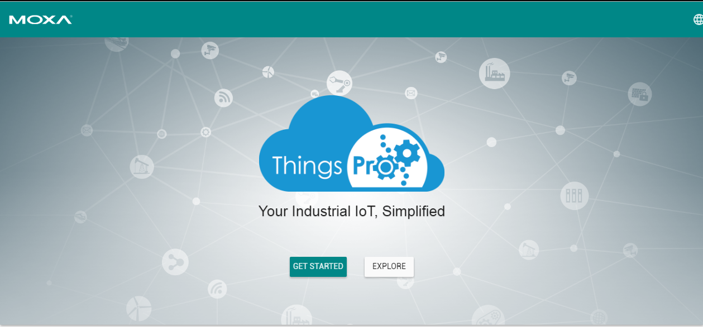

-   Use the following root user credentials to login:

Email: **root@moxa.com** Password: **root1234**
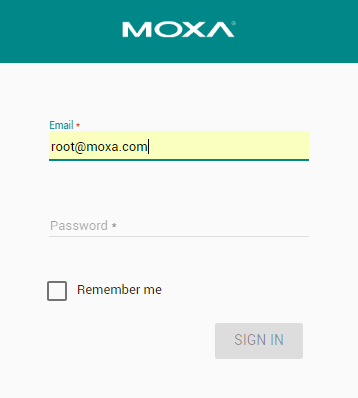

-   Click **Menu**

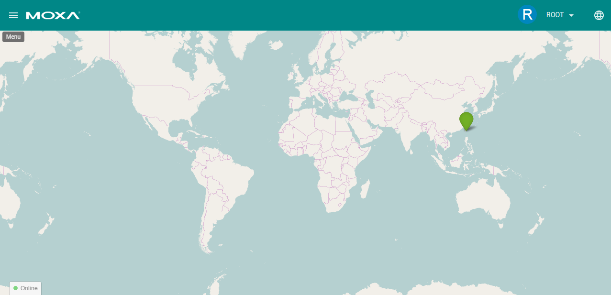

-   Click **Token**

> 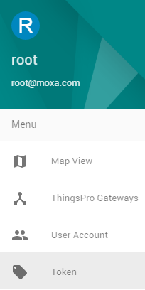

-   Click **Add Token**

> 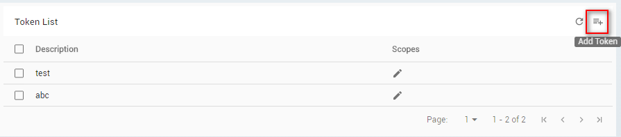

-   Fill in description, select token's scope (select Read/Write) and
    Click **SAVE**

> 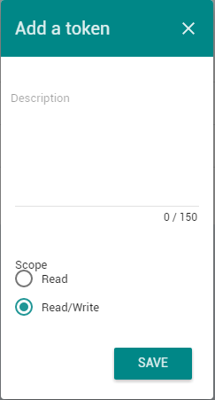

**Note: The scope of the token includes Read and Read/Write
privileges.**

**Select Read scope, if you only need to get CG related information
through RESTful API.**

**Select Read/Write, if you need to configure CG’s parameters.**

-   After click **SAVE**, the token will show up on the top of the
    webpage.

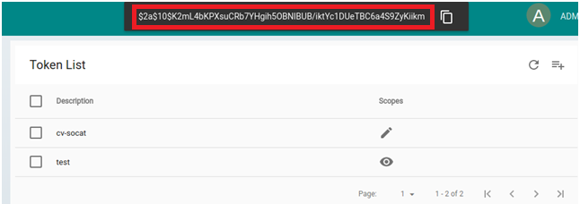

-   Click  to copy the token. Save it in a text file
    temporarily. You will use it during the development process.

Note: After Click , the token will disappear from the webpage. Save it
in a text file immediately, Otherwise, you need Add Token again.

### Step 3. Access RESTful APIs of ThingsPro Cloud Server

The format of REST URI in ThingsPro is:

**http://&lt;thingsproserver IP/host name&gt;/api/v1/&lt;resource&gt;**

The final part of the URI is the name of the resource, which determines
the response that you will receive from the API. Some resources may
require additional path parameters to identify a specific resource. For
example, the URI for the cloud gateway management would look like:

http://&lt;thingsproserver IP/host name&gt;/api/v1/devices

[Chrome
Extension](https://chrome.google.com/webstore/detail/postman/fhbjgbiflinjbdggehcddcbncdddomop),
Postman, can help you to emulate the request and response behavior
between your program and ThingsPro Gateway RESTful API.

The following section will show you the steps of get/post parameters to
ThingsPro cloud server RESTful API from notebook/PC.

-   **Example : Get the registered ThingsPro gateways' information**

> a\. Refer to ThingsPro cloud server RESTful API document. Using File
> explorer to open ThingsPro handbook:
> **\\thingspro-handbook\\output\\reference\\server-ui\\**
>
> 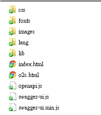
>
> b\. Double Click **index.html**, you can see all of ThingsPro cloud
> server RESTful API
>
> 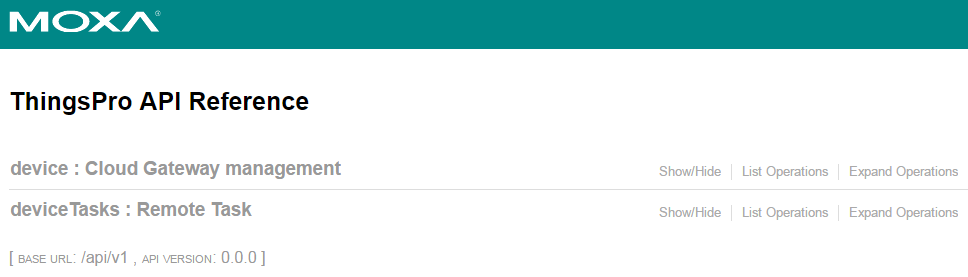
>
> c\. Click **device,** you can see the resources of **device**.
>
> 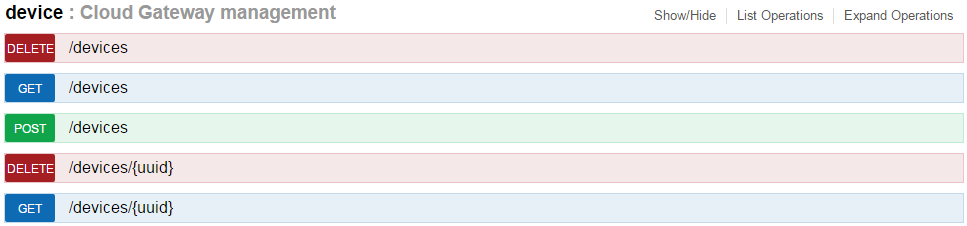
>
> d\. Click **/devices,** you can see to description of the resource and
> Response code.
>
> 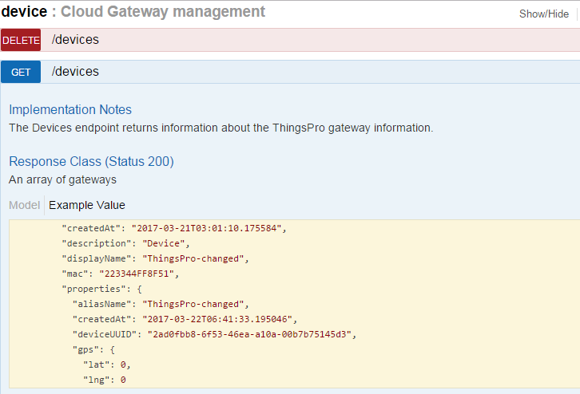

f\. Now, you can use Postman to get value from the **/devices** resource

-   Open Chrome Browser and run Postman APP

-   Select **GET**

> 

-   Fill in “Enter request URL” field with **http://&lt;thingsproserver
    IP/host name &gt;/api/v1/&lt;resource&gt;**

> e.g:
> [*http://52.52.52.52/api/v1/devices*](http://52.52.52.52/api/v1/devices)
>
> 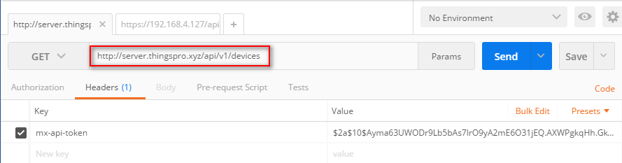

-   Click **Headers** tab, Click **key** column then key in the keyword:
    **mx-api-token**

<!-- -->

-   Click **Value** column then paste token you copy.

> 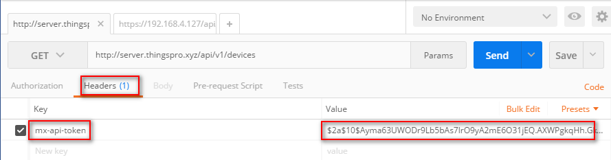

-   Click **Send** to send the request to the ThingsPro RESTful
    resource. If everything alright, it will response all registered
    ThingsPro gateways' information. E.g: deviceUUID, online/offline
    status …etc.

> 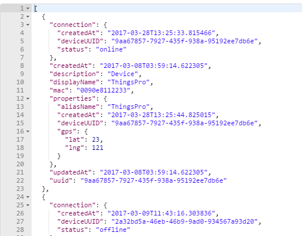

> When everything is as expected, you can use the programming language
> you preferred to develop program to access ThingsPro Gateway resource.
>
> Refer to handbook. It demonstrates how to curl command, C and Python
> language access these resource.
>
> 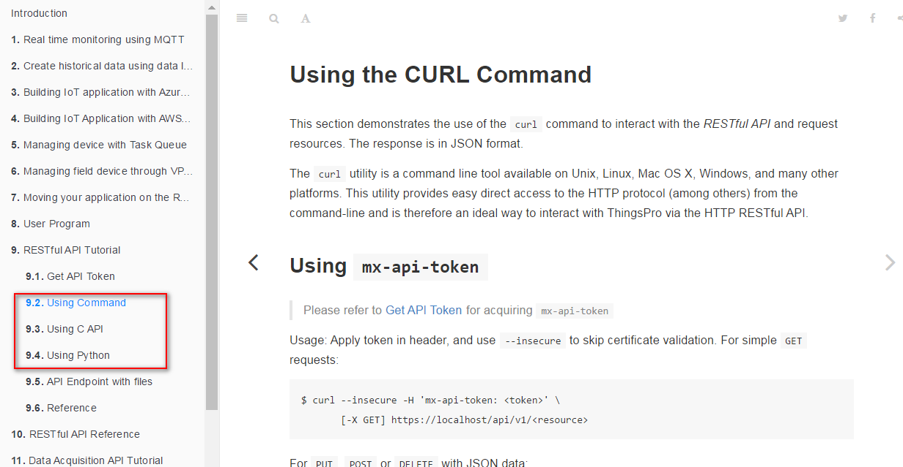

### Step 4. Using **deviceTasks** RESTful API of ThingsPro Cloud Sever to monitor/control ThingsPro Cloud gateway

-   **Example 1: Have ThingsPro Cloud Sever to get one of the registered
    ThingsPro gateway’s system status**

> a\. Using File explorer to open ThingsPro CS handbook:
> **\\thingspro-handbook\\output\\reference\\server-ui\\**
>
> 
>
> b\. Double Click **index.html**, you can see all of ThingsPro cloud
> server RESTful API
>
> 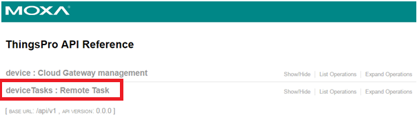
>
> c\. Click **deviceTask **
>
> d\. Click **/devicesTasks,** you can see to description of the resource,
> response, required **parameters**.
>
> 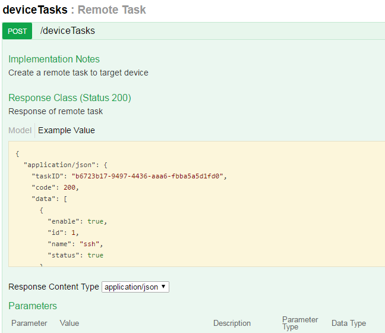
>
> 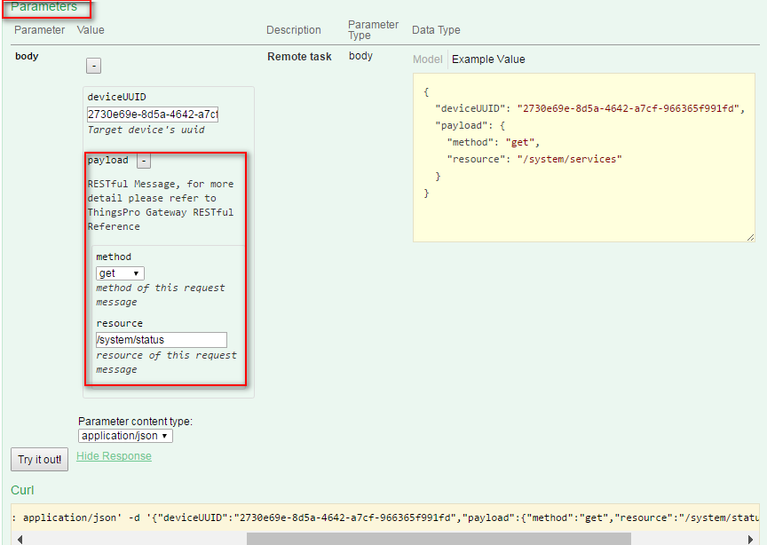

e\. Now, use Postman to post request to **/deviceTask** resource

-   Open Chrome Browser and run Postman APP

> 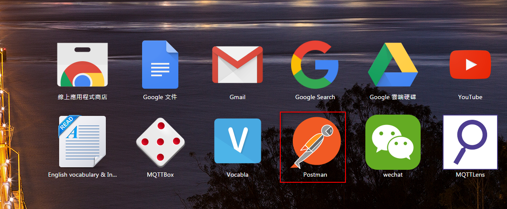

-   Select **POST**

> 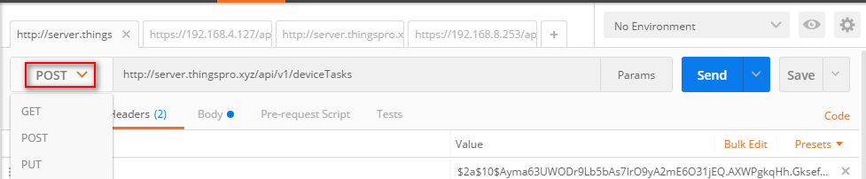

-   Fill in “Enter request URL” field with

> **http://&lt;thingsproserver IP/host name &gt;/api/v1/deviceTasks**
>
> e.g: http://52.52.52.52/api/v1/deviceTasks

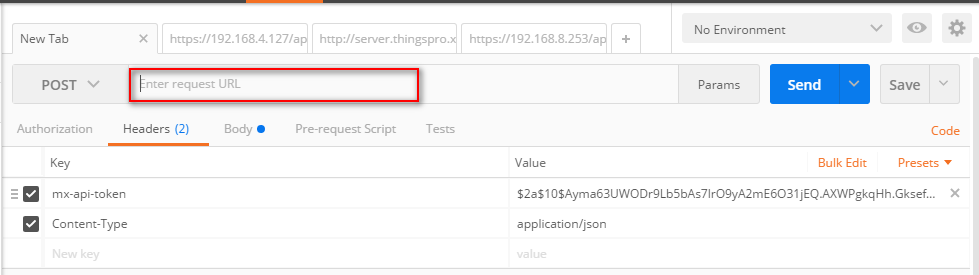

-   Click **Headers** tab, Click **key** column then key in the keyword:
    **mx-api-token**

<!-- -->

-   Click **Value** column then paste token you got from Step 2.

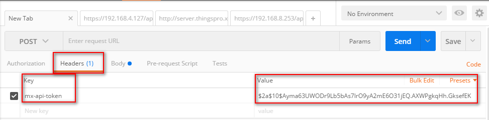

-   Click **New key** in next column, key in : **Content-Type**

 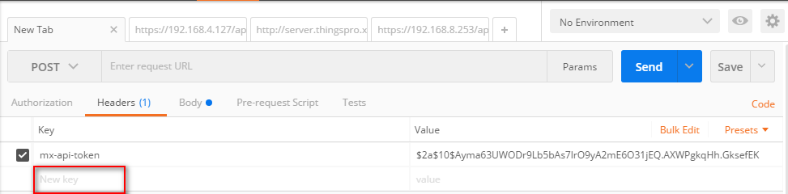

-   Click **Value** column, key in: **application/json**

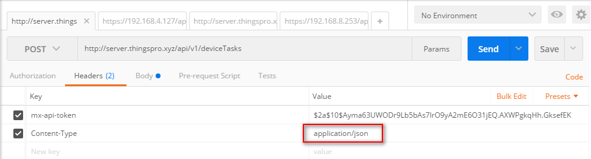

-   Click Body, Click **raw**

 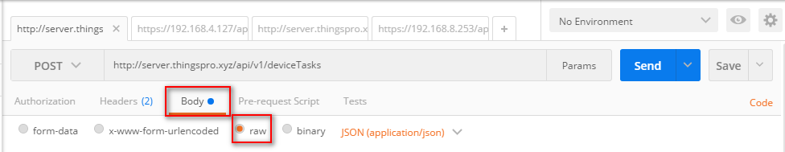

-   Fill in parameters, According to **CS API**, we need:

 

1.  **Target CG’s uuid** : refer to Step3 to Get the registered
    ThingsPro gateways' information and choose a deviceUUID and its
    status is online. **Note : the following UUID is an example. You
    should use different one.**

 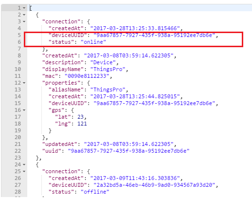
 
2.  **Payload**: message of CS sends request to CG. Refer to **CG API**
    (\\thingspro-handbook\\output\\reference\\gateway-ui\\) to choose
    **method and resource** you need.

> This example is get **system status** of the registered CG
>
> 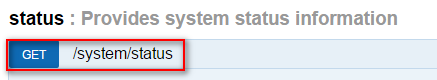
>
> Fill **deviceUUID** and **payload** message by JSON format. See
> below: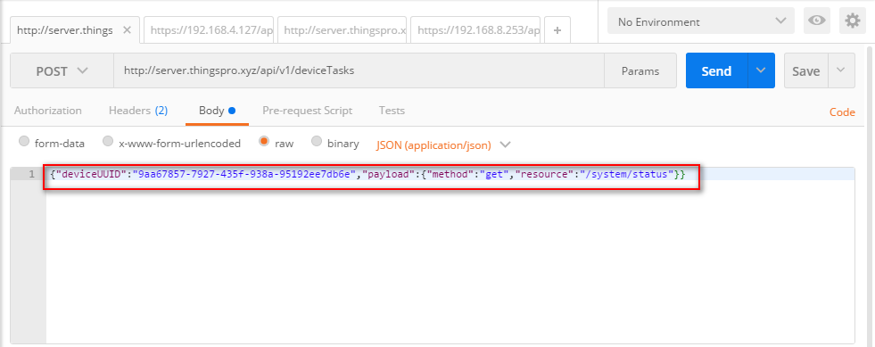

-   Click **Send**. If everything all right, it will response the CG’s
    information.

> 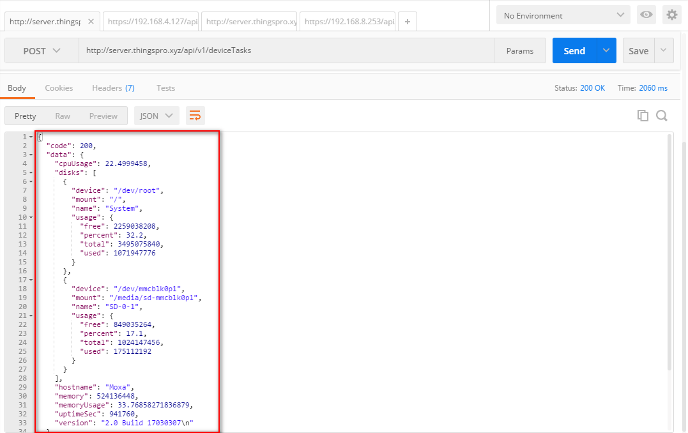

-   **Example 2: Have CS to disable one of the registered CG’s ssh
    service**

    -   To Fill in parameters, According to **CS API**, we need:

1.  **Target CG’s UUID** :

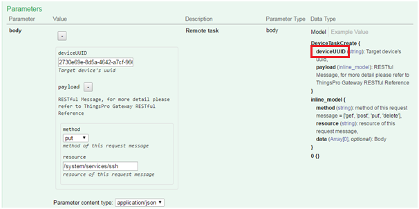

> Refer to Step3 to Get the registered ThingsPro gateways' information
> and choose one deviceUUID and its status is online. **Note : the
> following UUID is an example. You should use different one.**
>
> 

2.  **Payload**: includes **method, resource and data**.

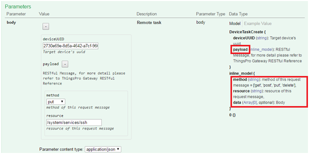

> Refer to **CG API**
> (\\thingspro-handbook\\output\\reference\\gateway-ui\\) to choose
> **method, resource, data** you need.
>
> This example is disable **ssh service** of the registered CG. The
> value of parameters should be:
>
> **Method**: PUT
>
> **Resource**: /system/services/ssh
>
> **Data**: {"id":1,"enable":false,"name":"ssh","status":"true"}

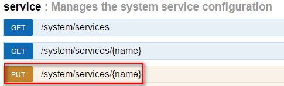

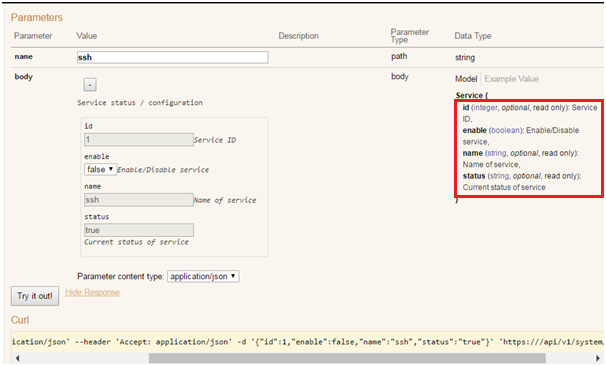

> Fill **deviceUUID** and **payload** message by JSON format. See below:
>
> 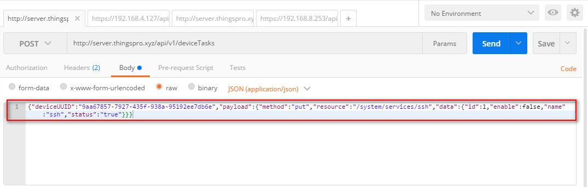

-   Click **Send**. If everything all right, it will response the
    information with code 200.

> 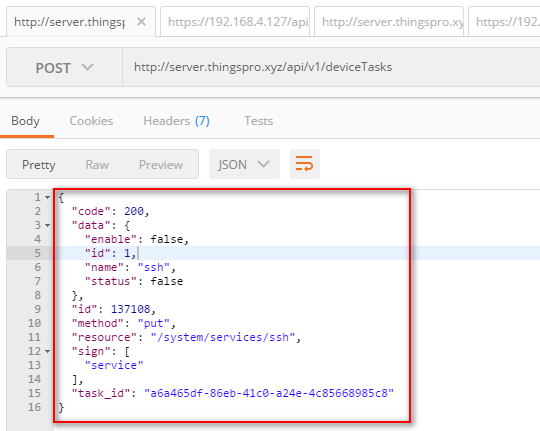
