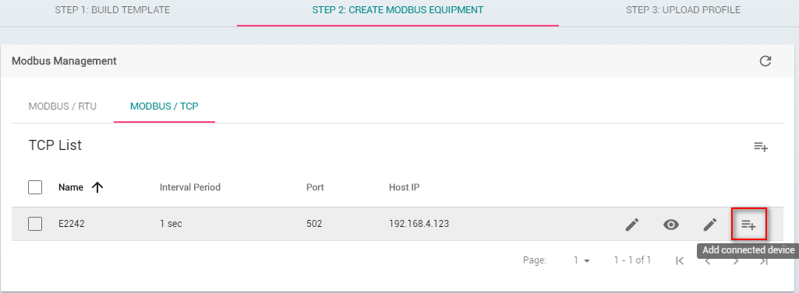
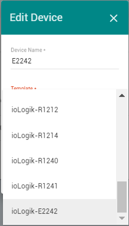
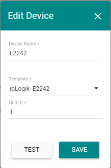
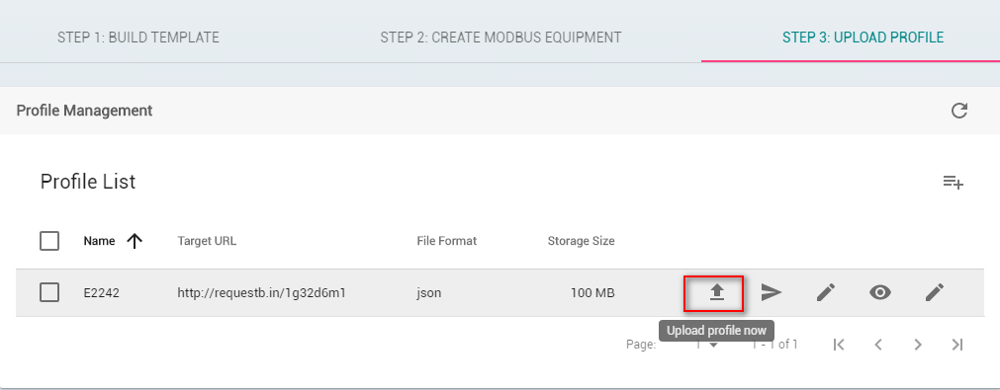

# Create historical data using data logging

Author: Andy

## Introduction 
For Industrial IoT applications, the value is in the data. Before the data can be used however, it must be extracted from thousands of industrial sensors and machines. This is often a cumbersome and time-consuming task, not to mention a drain on engineering resources. Moxa’s Industrial Computing Solution is an integrated data acquisition and device management platform designed for large-scale, Industrial IoT applications that help overcome the aforementioned problems. Moxa’s ThingsPro™ Suite 2.0, a set of software solutions that are designed to simplify the development of applications that facilitate remote device management and data acquisition. The ThingsPro Suite 2.0 enables the integration of Modbus communications, data acquisition, wireless networking, and device management, all in a few simple steps, allowing users to focus on their applications instead of complex integrations.  

## Application Scenario 
ThingsPro Suite 2.0 as a Modbus Data Logger to create historical Database of Field Devices.

For users who develop data acquisition and asset management software programs on their own database, the ThingsPro™ Suite provides the ability to transfer field data directly into the remote database without any additional programming on the gateway. Because ThingsPro™ Suite includes generic Modbus protocol support, users can easily configure the protocol polling tables and then all the data can be uploaded to the back-end database for SCADA/Dashboard to show the devices’ status.
  
### Prerequisites 
1. A Moxa UC-8112 w/ ThingsPro Suite, SD card and Internet access. For information about setting up your Moxa UC-8112, see UC-8112 ThingsPro user's manual. 
2. PC/Notebook w/ Chrome browser
3. Modbus device (e.g. Moxa ioLogik-E2242) 
 
### Get started 
In this section we describe how to configure the MODBUS device template in ThingsPro and retrieve data from ThingsPro and upload to a remote http server. Follow 3 main steps below 
1. ***BUILD TEMPLATE***
 - Click **Menu**   

 - Click **Modbus & Logging**   

Confirm if the Modbus device name already existed in the Template List or you can create a new template in the Template List. (For more information about creating a new template, see user’s manual).  
In this article, we assume the Modbus device name is E2242 which is already existed in the Template List.   

2.***CREATE MODBUS EQUIPMENT***    
Configure Modbus devices in template list with different communication interfaces (serial or Ethernet). Because the connected device, E2242, uses Modbus TCP protocol, choose Modbus/TCP option.  
 - Click **STEP 2: CREATE MODBUS EQUIPMENT**
 - Click **MODBUS/TCP**

 - Click Add TCP interface

 - Fill in Interface Name, IP of the Modbus TCP device, TCP port of the Modbus TCP device, query interval, response timeout. Click SAVE, the Modbus/TCP interface is listed in TCP list.  

 - Click Add connected device

 - Fill in Device Name you preferred  

 - Select Template to combine MODBUS/TCP interface with the Modbus device   

 - Assign Unit ID as 1, Click **SAVE**   

Now, ThingsPro is polling data from the device and feeding them to specific ThingsPro MQTT topic continually.   

 
 - Click **Show connected devices**   

If the Request Status is green, ThingsPro is able to query the Modbus TCP device without problem.   

3.***UpLOAD PROFILE*** 

This section describes how to configure the service of uploading data in ThingsPro. You can use this service to store data to log files and then send these files to remote HTTP servers. 
 
 - Click **Add profile**   

  
 - Fill in the following details for the new profile and Click **SAVE**   

| **Field** | **Description** |
| ----------- | ------------------------------------------------------------------------------------------- |
| **Name**        | Specify a name for the new log profile. Length: 3-255 characters. Format: a-z, A-Z, 0-9, '_', '-'  |
| **Target URL**  | Specify the complete URL of the remote server to which the data log files associated with this profile should be uploaded. |  
| **HTTP Basic Authentication** | Select this option to enable HTTP basic authentication |
| **No Check Certificate** | Select this option to skip the certificate check on the HTTPS connection |
| **Enable Compression** | Enable file compression of the data files.  |
| **File Rotate count** | Specify numbers of log file for this profile |
| **File Format** | Select a file format: XML, JSON, or CSV  |
NOTE: These formats are not that of the device log file, but are the file formats that you can use to download/upload data from the data logger  
Schedule 
Set an upload schedule for the data log files. For example, daily at a specified time, hourly, or even every minute.  
 
 - Click **Test** target connection to make sure that the target URL is valid.   

 - Click **Edit upload setting**   

 - Select the Connected Device which lists the device name we configured in previous section. See here   
 - Select the tags.   
 - Click **SAVE** 

 - Click **Upload profile** now, the log file from Modbus Device will be upload to remote http server immediately.   

 
When HTTP server program receives the log files, user can use program to process these data, store them to database. Finally, users can focus on developing data progessing programs, SCADA/Dashboard without having to worry about how to transfer the data to the back-end server.

### Additionsal reading
[InfluxDB in Grafana](http://docs.grafana.org/features/datasources/influxdb/)

 