# Building an IoT Application with Moxa's ThingsPro and AWS IoT 

Author: Andy

## Introduction 
Moxa’s ThingsPro™ 2.0 Suite is a set of software solutions designed to simplify development of applications and facilitate remote device management as well as data acquisition. ThingsPro 2.0 enables the integration of Modbus communications, data acquisition, wireless networking, and device management, all in a few simple steps, allowing users to focus on developing applications instead of complex system integration.

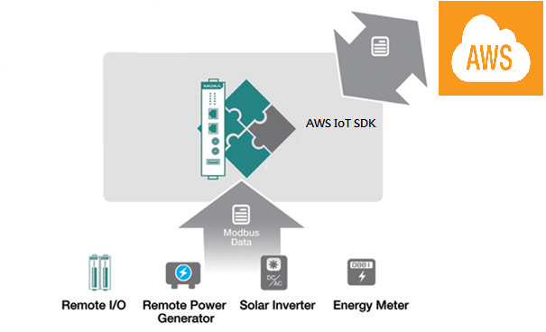

For users who develop data acquisition and asset management software programs on their own database, the ThingsPro™ Suite provides the ability to transfer field data directly to the AWS IoT service without any additional programming on the gateway. Because ThingsPro™ Suite includes generic Modbus protocol and AWS IoT support, which you can use to easily configure the protocol polling tables, AWS IoT connection settings. You can then upload the data to the AWS IoT service. In this section we describe how to configure the MODBUS device template in ThingsPro, retrieve data from ThingsPro, and upload the data to a remote HTTP server.

## Application Scenario 
In this article we set up an environment to send real-time device data updates to the AWS IoT service using ThingsPro 2.0 as a Modbus data logger and the AWS IoT function provided by ThingsPro to configure a connection with the AWS IoT service.

### Prerequisites
1. A Moxa UC-8112 gateway computer with ThingsPro Suite, SD card, and Internet access. 
   For information about setting up your Moxa UC-8112, refer to the ThingsPro User's Manual.
2. PC/notebook with Chrome browser
3. Modbus device (E.g.: Moxa ioLogik-E2242) 
4. [AWS IoT configuration: thing name, CA certificate, device certificate, device private key, mqtt topics, and mqtt endpoint ](https://hackernoon.com/building-an-iot-dashboard-using-the-onion-omega-and-amazon-aws-a3520f850c9#.ux6ue8w0f)
 
### Solution 
Complete the following steps to create your IIoT application using ThingsPro and AWS IoT service: 
1. ***Choose an equipment template***

 a. In the ThingsPro Gateway web page, click (Menu).   
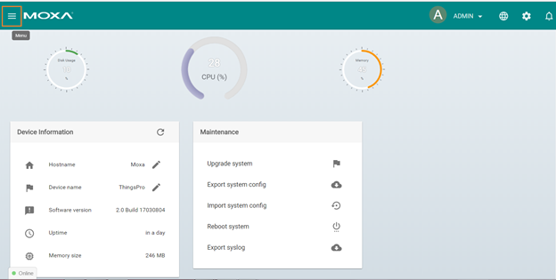

 b. Click **Modbus & Logging**.   
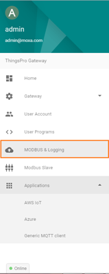

 c. In the **EQUIPMENT TEMPLATE** tab, browse through the **Template List** to locate the template corresponding to the Modbus device or create a new template.
    For details on creating a new template, refer to the ThingsPro User’s Manual. In this article, we will use the Modbus device E2242, which is already listed in the Template List.
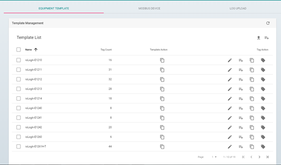

2.***Create an instance of the Modbus device.***

 a. Select the **MODBUS DEVICE** tab.
 
 b. Configure the Modbus devices in template list with a communication interface (serial or Ethernet). Because the connected device, E2242, uses Modbus TCP protocol, click on the **MODBUS/TCP** tab.

  I. Click (Add TCP interface).   
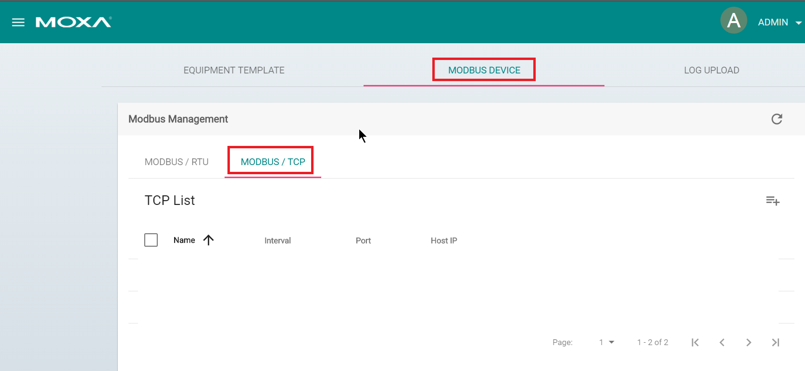
  II. Fill in the TCP interface settings and click **SAVE**.     
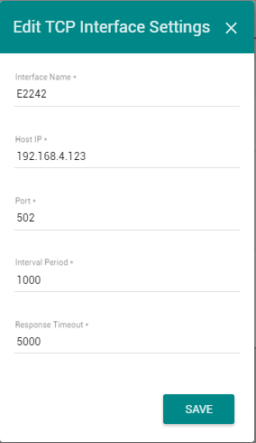

    The Modbus/TCP interface for E2242 is added to the TCP list.

  III. Click on the (Add connected device) button corresponding to E2242 to add a connected device.   
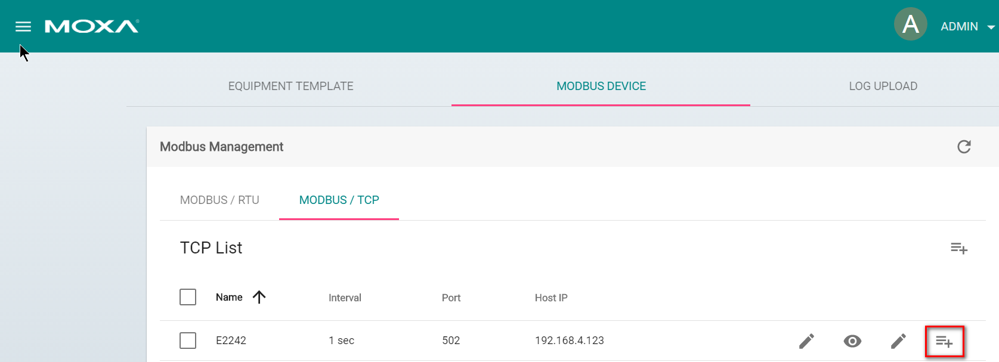

  IV. Fill in **Device Name**.
  
  V. Select a **Template** to combine MODBUS/TCP interface with the Modbus device.  
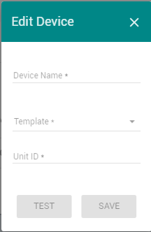

  VI.Specify the **Unit ID** for the device and click **SAVE**.     

    ThingsPro will now start continuously polling data from the device.
To check the status, click (Show connected devices). If the **Request Status** is green, ThingsPro is able to send requests to the Modbus TCP device and receive data.
    
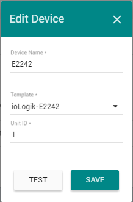

3.***Use AWS IoT service for real-time data update***

 a. Click on the **AWS IoT** link in the **Applications** section of the ThingsPro Menu.
 
 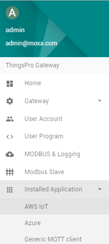
 
 b. Fill in the **Device connection string**.
 
 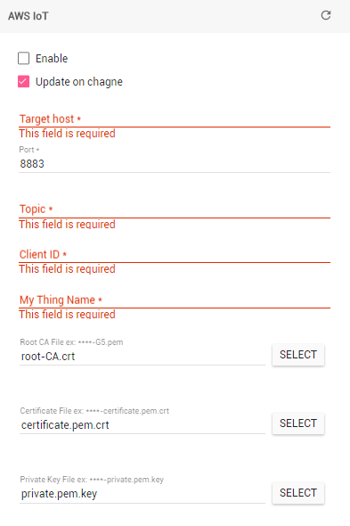
 
 c. Switch on the **Enable** option
 
 d. Click **SAVE** 

    The AWS IoT interface will use the information provided to create a connection to the AWS IoT service. Once the connection is established, data can be uploaded to the AWS IoT service in real-time.

### Additional Reading
1. [Getting Started with AWS IoT](http://docs.aws.amazon.com/iot/latest/developerguide/iot-gs.html)

