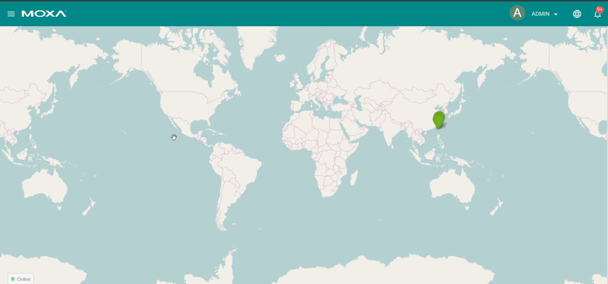

# Managing device with Task Queue

Author: Andy

## Introduction 
Moxa’s ThingsPro™ Suite 2.0, a set of software solutions that are designed to simplify the development of applications that facilitate remote device management and data acquisition. The ThingsPro Suite 2.0 enables the integration of Modbus communications, data acquisition, wireless networking, and device management, all in a few simple steps, allowing users to focus on their applications instead of complex integrations.

## Application Scenario 
ThingsPro Suite 2.0 server manages remote ThingsPro Gateways by Group function.
A field site deployed hundreds of cloud gateways for data acquisition. User who want to use ThingsPro server ready-to-go device management function to manage all of these gateways from central site. Because ThingsPro server provides the ability to manage remote ThingsPro gateways in groups, users can easily upgrade firmware, reboot and configure multiple remote ThingsPro gateways which in the same group simultaneously. 

### Prerequisites
1. Some Moxa UC-8112s with ThingsPro gateway and Internet access. For information about setting up your Moxa UC-8112, see UC-8112 Software user's manual.
2. PC/Notebook w/ Chrome browser
3. Moxa ThingsPro server hosts on Cloud services (e.g.: AWS, Azure ...etc.) or your own private server.
 
### Get started
In this section we describe how to add ThingsPro gateways to grouping function of ThingsPro server and manage these gateways by group tasks of grouping function. Follow 3 main steps below 
1. ***Show Device List***
 - Login ThingsPro server
Open a browser, and connect to your ThingsPro server Host name/ IP address. ***E.g.: https://< your ThingsPro server Host name/ IP address>***
 - Click ***Get Started*** to continue
    
    
 - Type the default username and password: ***Username: admin@moxa.com Password: admin1234***
 
    
 - Click ***Sign In*** to continue. You can see the main screen of the ThingsPro server page.
 
    
 - Click the ***menu** bar icon to continue.
 
    
 - Click ***ThingsPro Gateway*** to show all registered ThingsPro gateways.
 
    
 - In Device List, it lists all registered ThingsPro gateways, their internet connection status and other information.
  
    

2. ***Grouping ThingsPro gateways***

To put these gateways into one or more groups, follow the steps below:
 - a. Check ThingsPro gateways you want to put them into a group and Click ***Group Devices*** button.
 
    
 - b. Fill in name of the group (e.g.: Group 1), and click ***Save***
 
    
 - c. A new group will listed in ***group list***. Repeat step a to c, if you need to create new group.
 
    

3. ***Manage gateways by groups***

Uers can easily to do following operations to multiple remote ThingsPro gateways which are in the same group simultaneously.
 - Upgrade firmware 
 - Reboot           
 - Restore configurations 

And there are three options for above operations.

 - No retry: Execute the operation once right now and if the operation fails, it will not retry anymore.
 - Retry Times: Execute the operation right now and if the operation fails, it will do this operation at the assigned times in 10 seconds.
 - Schedule: Execute the operation once at the specific time you assigned.

### Example 1: User wants to reboot ThingPro gateways in Group 1 immediately. Follow the steps below:
 - a. Click  , Click ***No Retry***, and Click ***Reboot***
 
    
 - b. Click  to see the task status.
 
    
    
After ThingPro gateways reboot successfully, the status will show ***SUCCESS***.

 

### Example 2: User wants to reboot ThingPro gateways in Group 1 at the specific time. Follow the steps below:
 - a. Click , Click ***Schedule***, specify the date and time then Click Reboot. 
 
    
    
When configuring successfully, it will show following information.

 
 - b. Click   to check if the reboot task listed in the Task List.
 
    

Refer to above examples, user can do ***Upgrade firmware*** and ***Restore configuration*** by above similar steps.

Note: There is a constraint of the grouping function. Currently, each group is able to assign only one task. Before finishing the assigned task, thingspro will pop up an error message, when you add another new task.

By using the Group function of Moxa’s ThingsPro™ Suite 2.0 server, users can upgrade firmware, reboot and configure multiple remote ThingsPro gateways easliy and effectively.
users can easily upgrade firmware, reboot and configure multiple remote ThingsPro gateways

