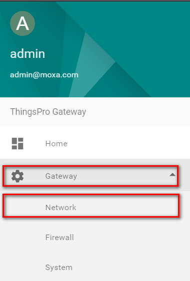

# Managing field device through VPN tunnel

Author: Andy

## Introduction 
As industry professionals keep up with the Industrial IoT trend and enjoy the benefits of valuable data transmission between devices, servers and databases, they are aware that privacy is a serious concern and industrial systems must be secure to prevent unauthorized access. Moxa ThingsPro gateway enhances security with a built-in VPN client and firewall functions, allowing users to set up a secure IoT network architecture for data transmission and device management or configuring.

## Application Scenario 
ThingsPro Gateway as a VPN gateway and firewall between control center and Field devices.

For users who want to use ThingsPro Gateway ready-to-go VPN client and firewall function to secure data transmission and manage all of field devices behind ThingPro gateway from remote site. Refer to the following instruction.
In this article, we assume that Moxa Iologik-E2242 (Field device) is behind ThingsPro gateway and we want to access Iologik-E2242 WEB configuration page (TCP port: 80) from remote site through VPN tunnel. The network diagram and IP is as below:

### Prerequisites
1. Some Moxa UC-8112s with ThingsPro gateway and Internet access. For information about setting up your Moxa UC-8112, see UC-8112 Software user's manual.
2. PC/Notebook w/ Chrome browser and VPN client installed
3. VPN server installed on Control center.

 
### Get started
OpenVPN is an open-source software application that implements virtual private network (VPN) techniques to create secure network connections. ThingsPro offers an OpenVPN Client function that helps you connect to an OpenVPN server to establish secure data communication. To configure the OpenVPN client in ThingsPro, do the following:

1. ***Configure VPN Client***

 - Login ThingsPro Gateway
Access the ThingsPro web interface by connecting to the following URL on eth1: https://192.168.4.127

 - Click ***Get Started*** to continue and type the default username and password:
    
    
 
 - Click ***Sign In*** to continue. 

    
    You can see the main screen of the ThingsPro server page.
 
    
 - Click the ***menu** bar icon to continue.
 
    
 - Click ***gateway***, click ***network***
 
    
 - Click on OpenVPN Client
  
    
 - Click on Settings panel, Click Settings

    
    
 - On the OpenVPN Client page, select the Enable option and then click Choose File to browse to and upload an OpenVPN configuration file.
 - Click Save. A message indicating that the OpenVPN client has been successfully updated.
'''NOTE The configuration file must contain the certificate and key information and must be saved in the *.ovpn format. You can click on Download to view a sample OpenVPN configuration file.
 - If you want to update the OpenVPN client settings, click on the Refresh button. If you want to delete the configuration file, click on Delete, or click on the Download button next to the Delete button to replace the configuration file.

   
   After successfully updated the configuration file, you can view the connection status of the client in the Connection Status field.

   

2. ***Configuring Firewall***

### ThingsPro’s Firewall is a network address translation (NAT) technique, which is most commonly used to make services on a host residing within a protected or internal network available to hosts on the opposite side of the gateway (external network) by remapping the destination IP address and port number to the internal devices.
To configure the Firewall in ThingsPro Gateway, do the following:

  - Click menu, Click gateway, click Firewall

  
  - Click add a rule

  
  - Fill in the following parameters of internal device. Click Save to store the configuration. If you want to enable the rule, select the Enable switch button and Click Save.

  
### Note: An Internal IP is the destination IP of a device that is connected to the gateway. An Internal Port is the destination Port of a device that is connected to the gateway. Internal Port and External Port are the port forwarding which forwards traffic from a specific external port to an internal host on a specified port.

  - According to above network diagram, the rule should be configured as below:

  

3. ***Access Iologik web from remote PC/notebook***

  - After the PC/notebook connects VPN server successfully, PC/notebook and ThingsPro gateway will be in the same network subnet. Also, we configured the firewall for forwarding network request from 80 port to internal iologik’s 80 port. Therefore, PC/notebook can use browser to access 192.168.254.1 and see iologik’s configuration web page.

