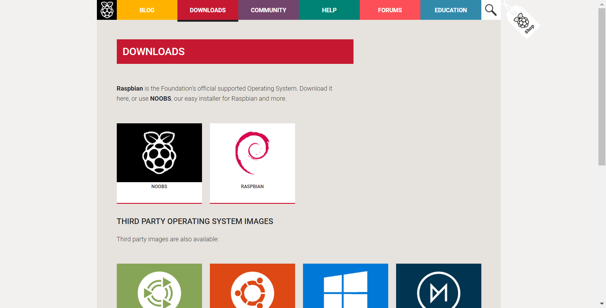
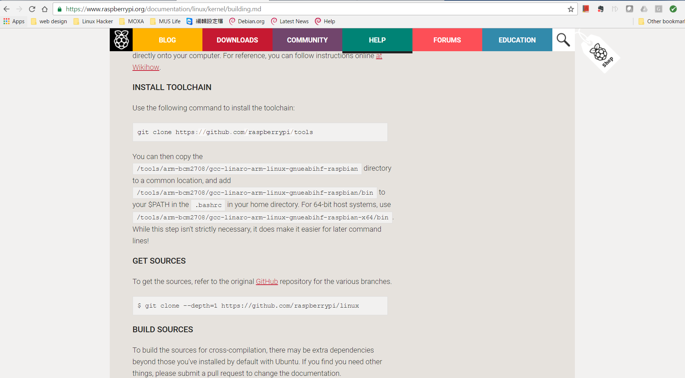
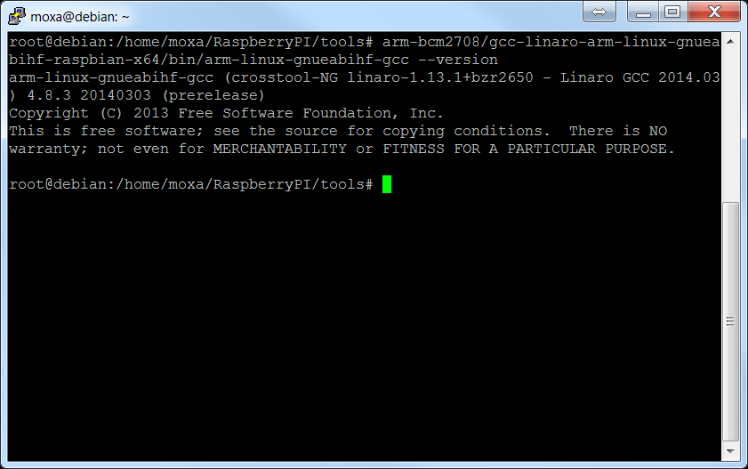
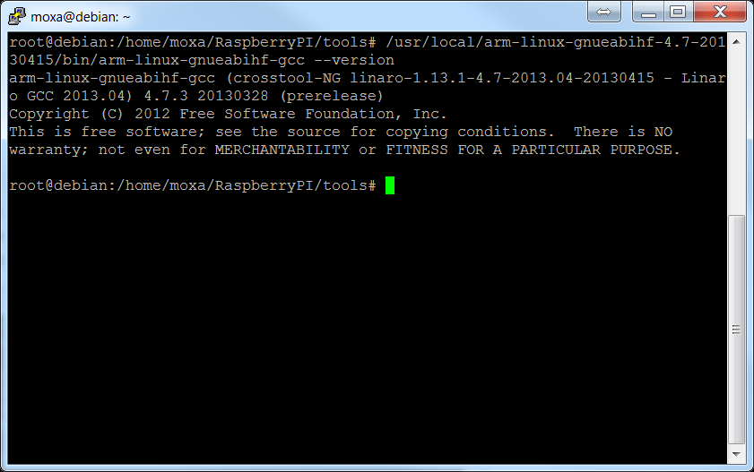
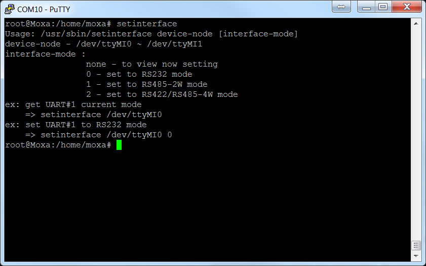
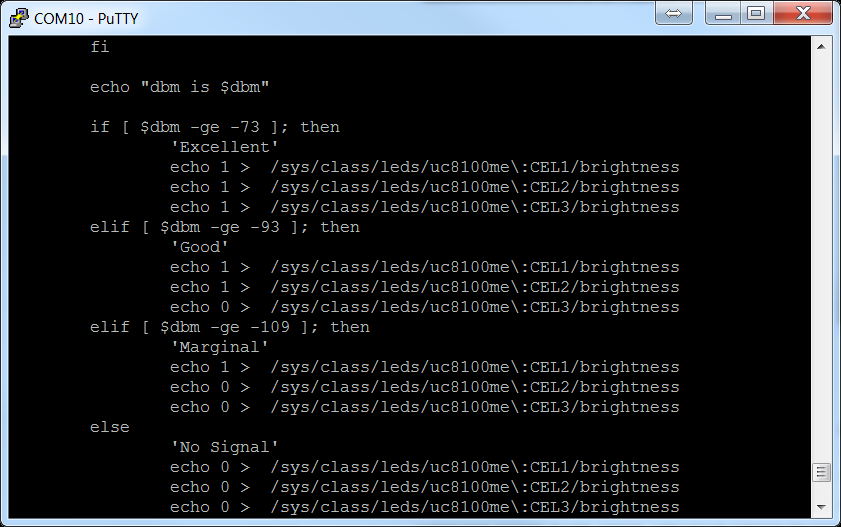

# Moving Your Application From Raspberry Pi to ThingsPro Gateway

Author: Jimmy Chen

## Background
The purpose of this document is to help you migrate your application from the Raspberry Pi to Moxa’s UC8100-LX computer so that you can easily move your application from a prototype to mass production and deployment. We highlight some key differences between the Raspberry Pi and Moxa’s UC8100-LX, including cross-compiler toolchain, peripherals, and system information.

## Requirement
+ UC-8100-LX/ UC-8100-LX-ME
+ Raspberry Pi 3 Model B Starter Pack (including 8 GB MicroSD card)

## Overview
The UC 8100-LX computer comes preinstalled with the Debian Linux distribution, which allows you to share an environment similar to the Raspberry Pi with Raspbian firmware installed.




We highlight a couple of differences between the two platforms to help you migrate your application from the Raspberry Pi to the UC8100-LX platform based on the following:
+ System environment
+ Compiler toolchain
+ Peripheral device programming


## System Environment

### Authentication
The default username/password on the Raspberry Pi is pi/raspberry, while the UC8100-LX uses moxa/moxa. On the Raspberry Pi, no authentication is required when you switch from the user pi to the root account. On the contrary, UC8100-LX requires root account password authentication (which is moxa) when you use the #sudo su command.

## Toolchains
Toolchains are utilities that are used to compile source code into executable programs in Linux. In the Linux ARM architectural environment, developers may develop their own programs with native compilers and cross compilers. Native compilers create executables that run only on the same machine/localhost, while cross compilers build programs that work on other machines.

### Native-Compiler Toolchain
The UC8100-LX comes pre-installed with the Debian distribution of Linux. Like the Raspberry Pi, UC8100-LX also supports native compilation. To install a native compiler on the Linux ARM platform, you just need to run the following command:
   ```
   apt-get install build-essential
   ```

### Cross-Compiler Toolchain and Environment Settings
Many users prefer to build ARM environments on x86/x86-64 machines. To be able to do this, they need to install the cross-compiler toolchain. The UC8100-LX and Raspberry Pi have different naming conventions for the cross-compiler toolchain, but their binaries are compatible.
The cross-compiler toolchain for Raspberry Pi can be downloaded from the GitHub server using the Git tool to clone the source files (see Figure 2). For the UC8100-LX, you can download the toolchain from the Moxa website.




The installation consists of using a shell script to extract the toolchain into the /usr/local directory. Once the installation is complete, you need to setup the PATH environment variable for your user account. The naming convention for the PATH variable is different in the two hardware platforms. On the Raspberry Pi, the PATH environment variable is set to /tools/arm-bmc2708/gcc-linaro-arm-linux-gnueabihf-raspbian/bin and on the UC8100-LX, it is set to /usr/local/arm-linux-gnueabihf-4.7-20130415/bin.

[](img/Figure3.png)

### Cross-Compiler Toolchain Compatibility
Both the UC-8100-LX and Raspberry Pi platforms share the same cross-compiler binary architecture, which means, the binaries that you run on the Raspberry Pi can be migrated to UC8100-LX without recompiling the source code.





However, if your source code on the Raspberry Pi includes access calls to peripherals, you need to change the device file names and system APIs to be able to use the source code on the UC8100-LX.

## Peripheral Device Programming
### Serial Devices
Raspberry Pi 3 provides 2 UART interfaces that the developers can implement. If you use the latest version of RASPBIAN firmware, these interfaces show up as /dev/serial0 and /dev/serial1.
On the UC8100-LX, the device node interfaces are /dev/ttyMI0 and /dev/ttyMI1. Note that the UC8100-LX has a 3-in-1 interface for each serial interface. You can use the setinterface command to set the RS323, RS422, and RS485 mode for each serial interface as shown in Figure 6.



### LEDs
On Raspberry Pi 3, you can either install the wiringPi (gpio example) or a Python example code to turn the LEDs on/off. Controlling the UC8100-LX LEDs is much easier. By default, all signal LEDs on the UC8100-LX are controlled by the chk_signal script. This program mainly reads the signal from cellular/Wi-Fi modules and changes the LED status according to the signal strength. Before you run the chk_signal script, you must stop the script using the #killall -9 chk_signal command to ensure that the process is not running. The LEDs are controlled by using the echo command and the values 0, 1. The value 1 turns the LED on, while 0 turns the LED off. The LED control file is locate at /sys/class/leds/uc8100me:CEL[X]/brightness, where [X] is the location of the LEDs with the options 1, 2, and 3. See the example in Figure 7 for information on turning the LEDs on:




## Additional Reading

- [https://www.raspberrypi.org/downloads](https://www.raspberrypi.org/download)
- [https://www.raspberrypi.org/documentation/linux/kernel/building.md](https://www.raspberrypi.org/documentation/linux/kernel/building.md)
- [http://www.moxa.com/product/uc-8100.htm](http://www.moxa.com/product/uc-8100.htm)
