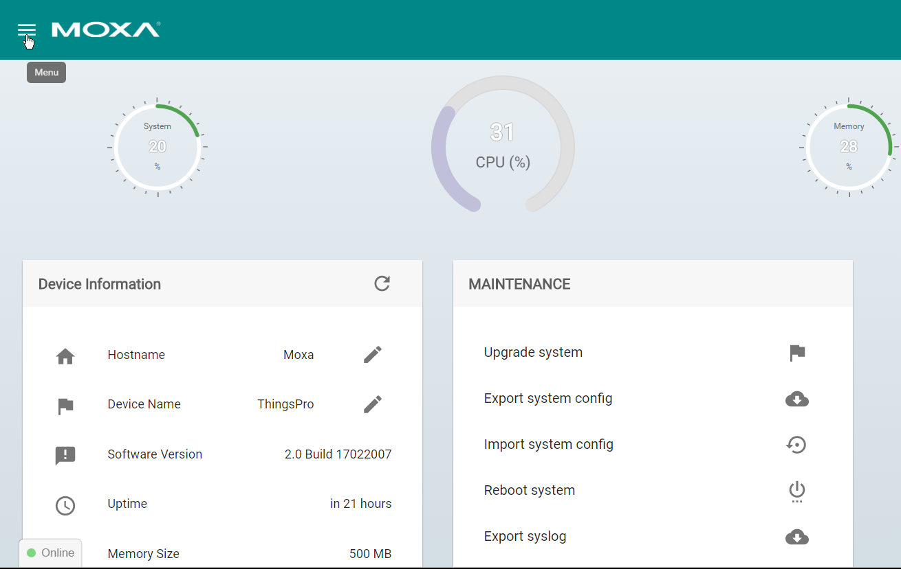
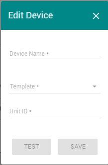
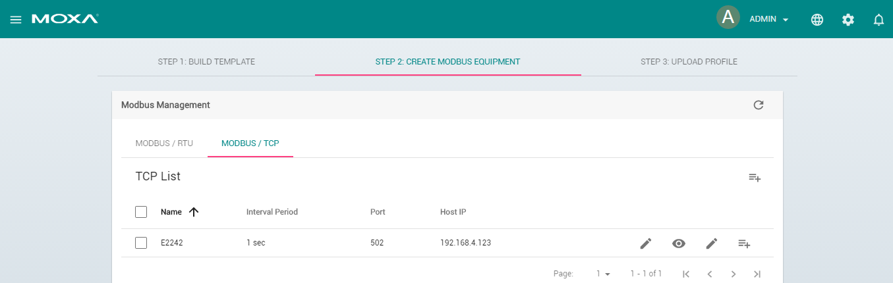

# Real time monitoring using MQTT

Author: Andy

## Introduction 
For Industrial IoT applications, the value is in the data. Before the data can be used however, it must be 
extracted from thousands of industrial sensors and machines. This is often a cumbersome and time-consuming task, not to mention a drain on engineering resources. Moxa’s Industrial Computing Solution is an integrated data acquisition and device management platform designed for large-scale, Industrial IoT applications that help overcome the aforementioned problems. Moxa’s ThingsPro™ Suite 2.0, a set of software solutions that are designed to simplify the development of applications that facilitate remote device management and data acquisition. The ThingsPro Suite 2.0 enables the integration of Modbus communications, data acquisition, wireless networking, and device management, all in a few simple steps, allowing users to focus on their applications instead of complex integrations.  

## Application Scenario 
ThingsPro Suite 2.0 as a Modbus Data Logger and update real-time status of Field Devices to remote MQTT broker by ThingsPro Gerneic MQTT Client.

For users who develop data acquisition and asset management software programs on their own database, the ThingsPro™ Suite provides the ability to transfer field data directly into the remote MQTT broker without any additional programming on the gateway. Because ThingsPro™ Suite includes generic Modbus protocol and MQTT client support, users can easily configure the protocol polling tables, MQTT broker connection settings and then all the data can be uploaded to the back-end MQTT broker. 
  
### Prerequisites
1. A Moxa UC-8112 w/ ThingsPro Suite, SD card and Internet access. For information about setting up your Moxa UC-8112, see UC-8112 ThingsPro user's manual.
2. PC/Notebook w/ Chrome browser
3. Modbus device (e.g. Moxa ioLogik-E2242) 
 
### Get started 
In this section we describe how to configure the MODBUS device template in ThingsPro and retrieve data from ThingsPro and upload to a remote http server. Follow 3 main steps below 
1. ***BUILD TEMPLATE***
 - Click **Menu**   

 - Click **Modbus & Logging**   

Confirm if the Modbus device name already existed in the Template List or you can create a new template in the Template List. (For more information about creating a new template, see user’s manual).  
In this article, we assume the Modbus device name is E2242 which is already existed in the Template List.    

2.***CREATE MODBUS EQUIPMENT***    
Configure Modbus devices in template list with different communication interfaces (serial or Ethernet). Because the connected device, E2242, uses Modbus TCP protocol, choose Modbus/TCP option.  
 - Click **STEP 2: CREATE MODBUS EQUIPMENT**   
 - Click **MODBUS/TCP**   

 - Click Add TCP interface   

 - Fill in Interface Name, IP of the Modbus TCP device, TCP port of the Modbus TCP device, query interval, response timeout. Click SAVE, the Modbus/TCP interface is listed in TCP list.     

 - Click Add connected device   

 - Fill in Device Name you preferred   

 - Select Template to combine MODBUS/TCP interface with the Modbus device    

 - Assign Unit ID as 1, Click **SAVE**    

Now, ThingsPro is polling data from the device continually.     

 
 - Click **Show connected devices**    

If the Request Status is green, ThingsPro is able to query the Modbus TCP device without problem.    

3.***Use Generic MQTT Client***    
 - Click **Menu**   

 - Click **Installed Application**   
 - Click **Generic MQTT Client**   

 - Click **Fill in remote MQTT broker required information**   

 - Switch ON the **Enable** option
 - Click **Save** 

After above configurating, MQTT client will be based on the configuration to create connection to remote MQTT broker then all the data can be updated to the back-end MQTT broker in real-time.    
Finally, users can focus on developing data progessing programs, SCADA/Dashboard without having to worry about how to transfer the data to the back-end MQTT broker.

