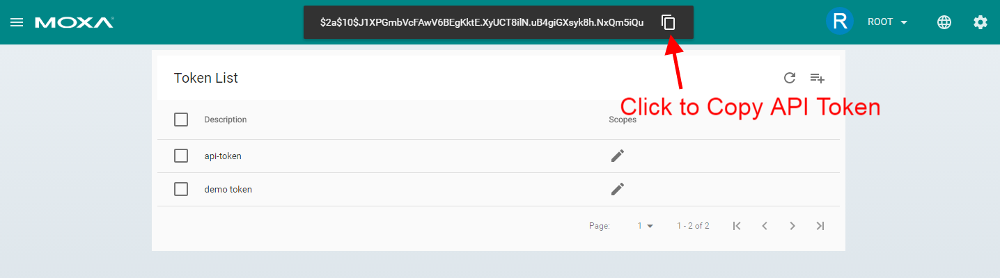
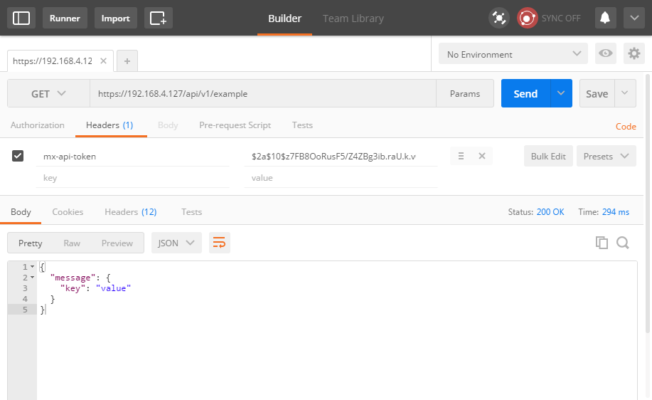

# Bundle Programming

ThingsPro Cloud Gateway provides the RESTful APIs required to create a device management and data acquisition framework. By creating a custom bundle, developers can extend the existing capabilities of the RESTful APIs using their own endpoints.

## Prerequisites
- ThingsPro v2.0 Cloud Gateway
- [Basic Python 2.7 programming skills](https://www.learnpython.org/)
- [Chrome](https://www.google.com.tw/chrome/browser/desktop/) with [Postman extension](https://chrome.google.com/webstore/detail/postman/fhbjgbiflinjbdggehcddcbncdddomop)
- Internet connection

## Do's and Don'ts
Before you start creating your own bundle, here are some basic guidelines.

### Do's

1. Configure the existing application or daemon and restart to apply the new configuration.
2. Create a RESTful endpoint using the existing ThingsPro Cloud Gateway Web Service.
3. Integrate with ThingsPro Cloud Gateway API token management function.
4. Respond to messages as soon as possible.


### Don'ts

1. Don't monitoring values by sending high-frequency requests to RESTful endpoints.
2. Don't override the existing resources.
3. Don't process long running jobs in a bundle.

## Creating Your First Bundle Program

> Replace the IP address `192.168.4.127` in the instructions below with the IP address of your ThingsPro Cloud Gateway.

1. Login using `ssh moxa@192.168.4.127` and change to root `sudo su`.

2. Download the [sample bundle](https://github.com/Sanji-IO/sanji-bundle-example/archive/master.tar.gz) and decompress it.

3. Execute the bundle using `cd sanji-bundle-example && python index.py`.

```
root@Moxa:/home/moxa/sanji-bundle-example# python index.py
2017-03-13 18:54:14,452 - DEBUG - 33 - Model: example config has been loaded.
2017-03-13 18:54:14,461 - DEBUG - 96 - Custom init start
2017-03-13 18:54:14,468 - DEBUG - 98 - Custom init finish
2017-03-13 18:54:14,475 - DEBUG - 228 - Thread pool is created
2017-03-13 18:54:14,479 - DEBUG - 63 - Start connecting to broker
2017-03-13 18:54:14,502 - DEBUG - 335 - Connection established with result code 0
2017-03-13 18:54:17,376 - DEBUG - 89 - Unsubscribe: ('c60b3b12913c426e9342c635becc5239',)
2017-03-13 18:54:17,383 - DEBUG - 98 - Subscribe: ('c60b3b12913c426e9342c635becc5239',)
2017-03-13 18:54:17,523 - DEBUG - 422 - Deregister successfully example tunnel: None
2017-03-13 18:54:17,594 - DEBUG - 422 - Deregister successfully example-view tunnel: None
2017-03-13 18:54:17,651 - DEBUG - 98 - Subscribe: ('128916389',)
2017-03-13 18:54:17,654 - DEBUG - 410 - Register successfully example tunnel: 128916389
2017-03-13 18:54:17,656 - DEBUG - 377 - example-view no need to register due to no resources
```

4. Test the RESTful API using the postman extension.
    1. Get an API token
        - From the token file: `cat /etc/mx-api-token`
        - From the ThingsPro Web Console: Log in using the root account. Click on the **Token** link in the main menu and press the  **Add Token** button.
    2. Copy the token string.
        
    3. Launch the postman extension using Chrome.
    4. Send a GET request to the API using `GET http://192.168.4.127/api/v1/example`.
    3. Paste the token string in the `mx-api-token` field.
    4. Click the **Send** button.
        

## Bundle Reference

### bundle.json
```
{
  "name": "example",
  "version": "0.0.1",
  "author": "Your Name Here",
  "email": "example@com.com",
  "description": "Description of this bundle",
  "license": "GPL",
  "main": "index.py",
  "argument": "",
  "priority": 99,
  "hook": [],
  "dependencies": {},
  "repository": "",
  "role": "model",
  "ttl": 60,
  "resources": [
    {
      "methods": ["get", "put"],
      "resource": "/example"
    }
  ]
}
```

- name
    - Name of this bundle, format: [A-Za-z\-]+
- version
    - Version number. recommend use:
- author
    - Author name
- email
    - Author's email
- description
    - Description of this bundle
- license
    - MIT, GPL, BSD, etc.
- main
    - fixed value: `index.py`
- argument
    - *Reserved field*
- priority
    - *Reserved field*
- hook
    - *Reserved field*
- dependencies
    - *Reserved field*
- repository
    - *Reserved field*
- role
    - fixed value: `model`
- ttl
    - Time to live (unit: second). This bundle should always response within n seconds.
- resources
    - method
        - Single method: `get`, `put`, `post`,`delete`
        - Array of methods: `["get", "post]`
    - Resource
        - Endpoint of this bundle

> The `/api/v1` prefix is automatically added to the final resources.

### index.py

Refer to the comments in `index.py`.
