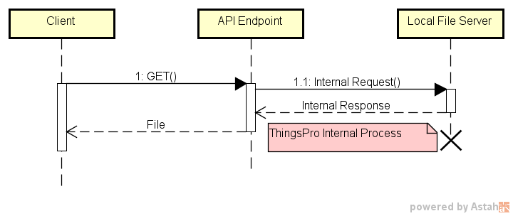
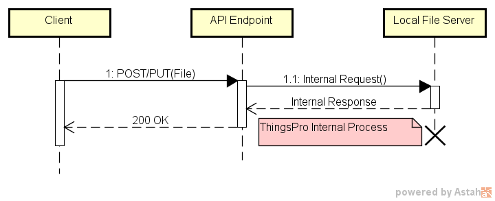
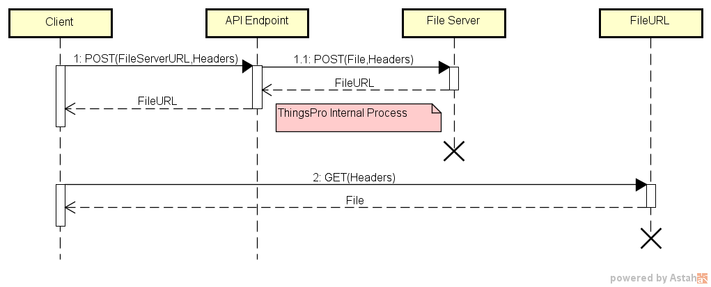
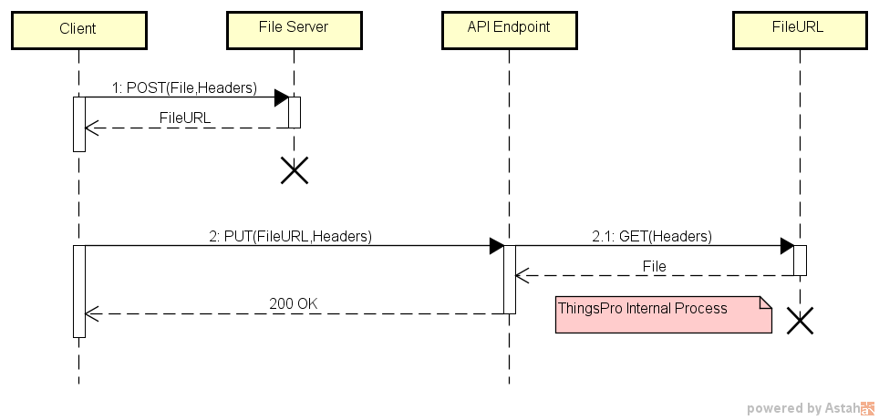

# API Endpoint with Files
In this article, we demonstrate how to upload/download files that contain API Endpoints.

(Example: `/system/export`; `/network/openvpn/config`)

## Overview
We use the example of importing and exporting system configuration files to explain how to call files that contain API endpoints.
This use case consists of the following components:
1. Client (user program)
2. API Endpoint (Bundle)
3. File Server (HTTP Server)

## Use Built-In *API Helpers* (recommended)
ThingsPro has built-in file server and API helpers.

### Downloading a File (Exporting a System Configuration File)
1. The **Client** sends a `HTTP GET /helper/download?resource=/system/export` request.
2. The **Client** receives the `HTTP 302 Redirect` to the download URL.

### Uploading a File (Importing a System Configuration File)
1. The **Client** sends a `HTTP POST /helper/upload?resource=/system/import` request.
   The `Content-Type` of the request must be `multipart/form-data` as follows:
	- `file`: File field
	- `jsonData`: Additional JSON string for target API endpoint.

2. The **Client** receives a response from the API endpoint.

## Using APIs

### Downloading a File (Exporting a System Configuration File)
1. The **Client** sends a `HTTP POST /api/v1/system/export` request for downloading a system configuration file to the **API Endpoint (Bundle)**. 
   For additional details on the POST request refer to the ThingsPro API reference.
2. The **API Endpoint (Bundle)** sends the HTTP POST request to the **File Server**.
3. The **File Server** responds to the API Endpoint with the download link(s).
4. The **API Endpoint (Bundle)** sends the response from file server to the client.
5. The **Client** receives the response from the API Endpoint and uses the URL provided therein to download the system configuration file.

### Uploading a File (Importing a System Configuration File) 
1. The **Client** sends a `HTTP POST /api/v1/files/upload` request to upload a system configuration file to a built-in local file server. 
2. The **File Server** receives files and responds to the client with download link(s).
3. The **Client** receives the response from the file server and sends a `HTTP PUT /api/v1/system/import` request to the API Endpoint specifying the URL for the system configuration file.
4. The **API Endpoint (Bundle)** takes the system configuration file from the URL and overwrites the original file.
5. The **Client** gets a response from the bundle and the ThingsPro Gateway will reboot automatically.

