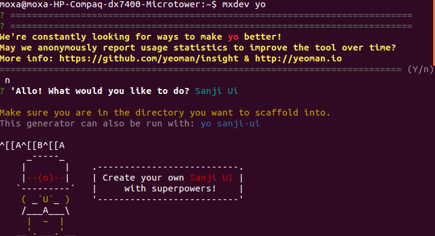
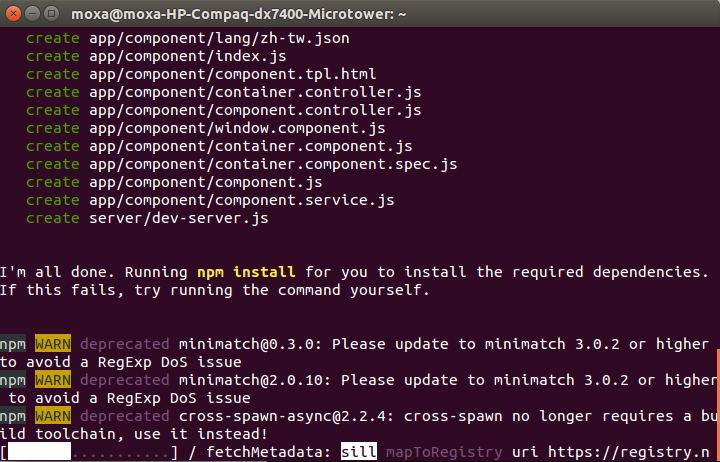

# Develop Web UI on PC

In order to customize Web UI on ThingsPro Gateway, Moxa provides a web UI generator. You can take advantage of this generator to develop Web UI quickly and easily. Execute the following command under command prompt:

```sh
moxa@moxa:~$ mxdev yo
```

#### Select Sanji Ui



Enter n to start create your own web UI
Answer the following questions then MOXA's framework will create a workspace for you to develop Web UI.
+ Would you mind telling me your username?
**example**
+ Would you mind telling me your email?
**hello@world.io**
+ What's the base name of your project? Prefix "sanji-" is already exist.
**example**
+ What's the ngModule name of your component? (this Module name will be the name of your workspace)
**example**
+ What is your semver version?
**1.0.0**
+ API resource is collection?
**No**
+ What's your api base path?
**/api/v1**
+ What's your endpoint? (the resource URI you created during developing the bundle)
**/example**
+ Description for this component?
**Example of UI**



When the web UI generator finishes its process, the workspace will be created in your home directory automatically.

#### Edit component.resource.json file to add the web form configuration you need.
```
vim sanji-example/src/component/component.resource.json
```

##### Example:

I need an input form for user to input user name. Add the following web form configurations to the bottom of component.resource.json:

```json
"fields": [
    {
         "type": "input",
         "key": "UserName",
         "templateOptions": {
             "label": "User Name"
         }
    }
]
```

For more up-to-date web form field types, refer to the github resources:
[https://github.com/Sanji-IO/sanji-core-ui](https://github.com/Sanji-IO/sanji-core-ui)

#### Generate Web UI package

After testing web UI successfully on your PC, press Ctrl+C to stop the web service. Execute "npm run build" under command prompt to generate web UI package for deployment on the ThingsPro Gateway. A XXXXX.tar.gz will be created under your web workspace.
