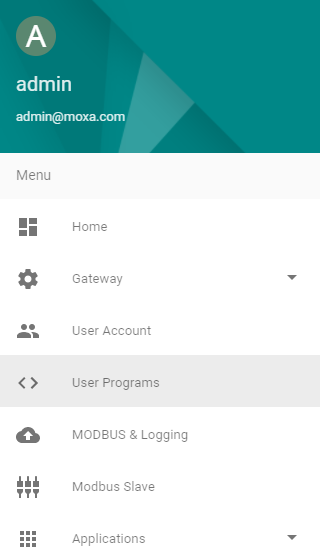
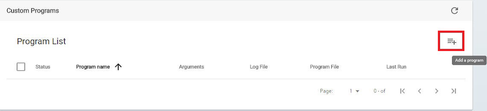
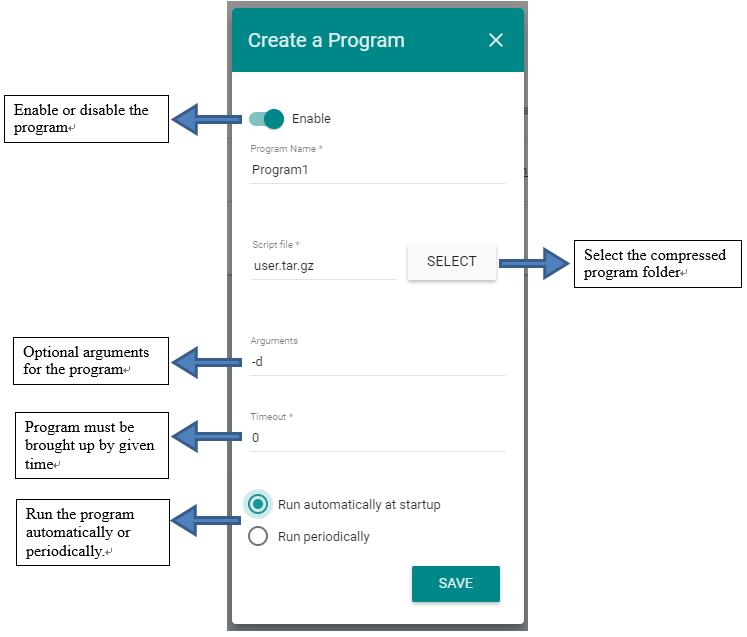
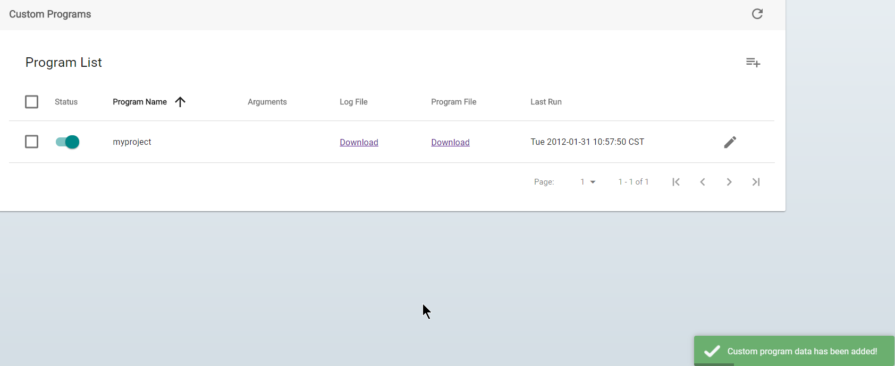

# Package Program

### Preparing the Programs for Deploying

Create the following folder structure for the user program that you want to upload and set the correct file permissions.

```
λ ~/ tree user-program
└─.
  ├── data
  │   └── example.json.factory
  ├── ui_folder
      ├── 6929858e-7da7-43e4-8c52-c0c3c4b96bf5
      └── ui.js
  ├── bundle.json
  ├── index.py
  ├── README.md
  └── requirements.txt
```
Maintaining this folder structure will make it easy for you to create a bundle for the user program by simply adding an *exec* file with *execution* permission.

### Create a Simple Program
Here is a simple script for printing the current date and time on Linux.
```sh
#!/bin/bash
date
```
### Add an Executable File
- `env` for printing all environment variables
- ThingsPro Cloud Gateway's RESTful API token will be set as `MX_API_TOKEN` environment variable.
- `python ./index.py` execute the target program (you could replace this line with your own program)

File `exec` content:
```sh
#!/bin/bash
env
python ./index.py
```
### Add UI layout folder(optional)
You can put your ui files(CSS, javascript files) below 'ui_folder' folder, then you can operate your custom ui on browser

### Use the tar Command to Compress the Folder

> Ensure that the `exec` file is placed in the main folder and not inside sub folders.

```sh
tar cvzf ../example.tar.gz .
```

##### Upload the Compressed Folder to the ThingsPro Gateway

Upload the `example.tar.gz` to the ThingsPro Gateway. The program will be available under the **User Programs** section of the main menu.

##### Upload the Compressed Folder to the ThingsPro Gateway
Now the user.tar.gz  file is ready. However there is still one step away to finish all the works for user program, **Upload**.

+ Entry the User Programs section of the main menu and click the “Add a program” button.





+ Follow the instruction as descripted in the figure to create the program.



+ Now you can see the program is under the user program List. At meanwhile, the access from Application section is also available.




For each `User Program`, we keep `Enable/Disable` and `Download log files` two functions in service. Thus developer still can control bring-up timing and trace stdout/stderr output without worries.
